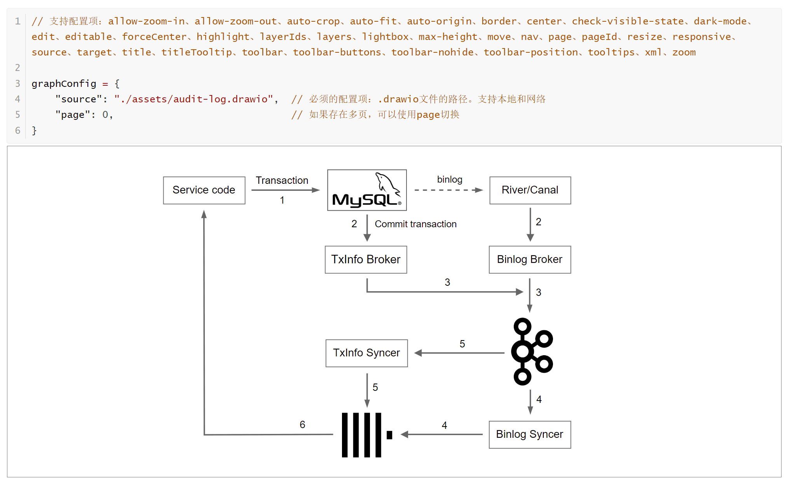
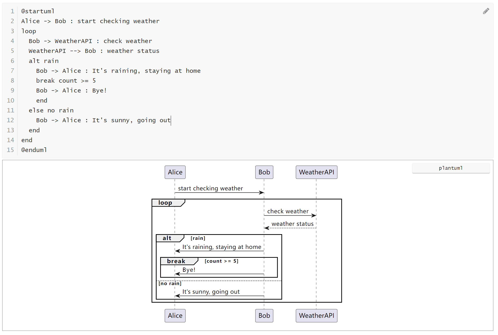

English | [简体中文](https://github.com/obgnail/typora_plugin/blob/master/README-cn.md)

<div align="center">
    <h1>Typora Plugin</h1>
    
    <p align="center">
        <a href="https://github.com/obgnail/typora_plugin/releases/latest"></a>
        <a href="https://github.com/obgnail/typora_plugin/stargazers"></a>
        <a href="https://github.com/obgnail/typora_plugin/issues"></a>
        <a href="https://github.com/obgnail/typora_plugin/tree/master/plugin"></a>
        <a href="https://github.com/obgnail/typora_plugin?tab=readme-ov-file#%E5%A6%82%E4%BD%95%E4%BD%BF%E7%94%A8%E6%96%B9%E6%B3%95%E4%B8%80%E8%87%AA%E5%8A%A8"></a>
        <a href="https://github.com/obgnail/typora_plugin/blob/master/LICENSE"></a>
        <a href="https://deepwiki.com/obgnail/typora_plugin"></a>
    </p>
</div>


| #    | Plugin                  | Function                                                  | Enabled by Default |
| ---- | ----------------------- | --------------------------------------------------------- | ------------------ |
| 1    | window_tab              | Window Tab Bar                                            |                    |
| 2    | search_multi            | Multi-Fields File Searcher                                |                    |
| 3    | collapse_paragraph      | Chapter Folding                                           | ×                  |
| 4    | collapse_list           | List Folding                                              | ×                  |
| 5    | collapse_table          | Table Folding                                             | ×                  |
| 6    | md_padding              | Chinese-English Text Spacer                               |                    |
| 7    | slash_commands          | Slash Commands                                            |                    |
| 8    | templater               | File Templater                                            |                    |
| 9    | resource_manager        | Resource Management                                       |                    |
| 10   | fence_enhance           | Enhance Fence                                             |                    |
| 11   | toc                     | TOC                                                       |                    |
| 12   | commander               | Commander                                                 |                    |
| 13   | toolbar                 | Multi-Purpose Searcher                                    |                    |
| 14   | right_click_menu        | Right-Click Menu                                          |                    |
| 15   | pie_menu                | Pie menu                                                  | ×                  |
| 16   | datatables              | Enhance Table                                             | ×                  |
| 17   | preferences             | Preferences                                               |                    |
| 18   | markmap                 | Provides Markmap support                                  |                    |
| 19   | echarts                 | Provides Echarts support                                  |                    |
| 20   | chart                   | Provides Chartjs support                                  |                    |
| 21   | drawIO                  | Provides DrawIO support                                   |                    |
| 22   | abc                     | Provides abcjs support                                    |                    |
| 23   | calendar                | Provides tui.calendar support                             |                    |
| 24   | wavedrom                | Provides WaveDrom support                                 |                    |
| 25   | marp                    | Provides Marp support                                     |                    |
| 26   | plantUML                | Provides plantUML support                                 | ×                  |
| 27   | callouts                | Provides Callouts support                                 |                    |
| 28   | text_stylize            | Text stylization                                          |                    |
| 29   | read_only               | Read-only mode                                            |                    |
| 30   | blur                    | Blur mode                                                 |                    |
| 31   | kanban                  | Kanban                                                    |                    |
| 32   | timeline                | Timeline                                                  |                    |
| 33   | chat                    | Chat                                                      |                    |
| 34   | file_counter            | Show file count in directory                              |                    |
| 35   | auto_number             | Auto Numbering                                            |                    |
| 36   | imageReviewer           | Image reviewer                                            |                    |
| 37   | chineseSymbolAutoPairer | Automatic completion of Chinese symbols                   |                    |
| 38   | resize_table            | Adjust table row height and column width                  |                    |
| 39   | resize_image            | Adjust image display size                                 |                    |
| 40   | export_enhance          | Avoid image loss when exporting to HTML                   |                    |
| 41   | markdownLint            | Markdown Lint Check                                       |                    |
| 42   | go_top                  | One-click to top of the article                           |                    |
| 43   | truncate_text           | Hide content to improve performance for large files       | ×                  |
| 44   | dark                    | Dark mode                                                 |                    |
| 45   | no_image                | No image mode                                             |                    |
| 46   | updater                 | One-click plugin update                                   |                    |
| 47   | easy_modify             | Editing tools                                             |                    |
| 48   | editor_width_slider     | Adjust writing area width                                 |                    |
| 49   | redirectLocalRootUrl    | Redirect local resource root directory                    | ×                  |
| 50   | blockSideBySide         | Display active blocks side by side                        | ×                  |
| 51   | scrollBookmarker        | Bookmark manager                                          | ×                  |
| 52   | cipher                  | Encrypt files                                             | ×                  |
| 53   | ripgrep                 | Search files using ripgrep                                | ×                  |
| 54   | article_uploader        | One-click upload blog to supported platforms              | ×                  |
| 55   | sortableOutline         | Drag & drop outline to rearrange                          | ×                  |
| 56   | cursor_history          | Cursor History                                            | ×                  |
| 57   | static_markers          | Static Markers                                            | ×                  |
| 58   | custom                  | Open platform for user-defined plugins (advanced)         |                    |
| 59   | hotkeys                 | Hotkey registration center (advanced)                     |                    |
| 60   | quickButton             | Add function buttons in the lower right corner (advanced) |                    |
| 61   | json_rpc                | External control of Typora (advanced)                     | ×                  |

> If you have other needs or find bugs, feel free to [open an issue](https://github.com/obgnail/typora_plugin/issues/new). PRs are also welcome. If you find this project helpful, please give me a star ⭐


## Q&A

- **Is my Typora supported?** Typora's version should be ≥ 0.9.98 (the last free version).
- **How to modify plugin configurations?** Right-click menu -> Less Used Plugins -> Preferences. **Respect all user choices**. Any plugin or feature can be permanently enabled/disabled.
- **How to upgrade plugins?** Right-click menu -> Less Used Plugins -> Upgrade Plugins.
- **How to uninstall plugins?** Right-click menu -> Less Used Plugins -> Preferences -> Uninstall Plugins.
- **How to develop plugins?** This project adheres to **No BuildTime**, so there is no need to install any development environment. Please refer to [Readme](https://github.com/obgnail/typora_plugin/blob/master/plugin/custom/README-en.md) for details.
- **Does it support Typora for Mac?** I don't have a Mac device, so I haven't tested it.
- **Any other questions?** Please ask [AI Wiki](https://deepwiki.com/obgnail/typora_plugin).


## How to Use: Windows/Linux Platform

Visit [Video Installation Tutorial](https://github.com/obgnail/typora_plugin/issues/847)

1. [Download](https://github.com/obgnail/typora_plugin/releases/latest) the plugin source code package and unzip it.

2. Go to the Typora installation path and find the folder A containing `window.html`.

   - For the official version of Typora, the path is `./resources/window.html`.

   - For the beta version of Typora, the path is `./resources/app/window.html`.

3. Paste the unzipped plugin folder into folder A.

4. Go to the folder `A/plugin/bin/`.

   - Windows: Right-Click on the file `installw_windows.ps1`. Select 'Run with PowerShell'.
   - Linux: Run `install_linux.sh` as administrator.

5. Verification: Restart Typora, right-click in the main text area, and if you see the `Often Used Plugins` column, everything is fine.


|           | Official Version                             | Beta Version                                 |
| --------- | -------------------------------------------- | -------------------------------------------- |
| Steps 2-3 |  |  |

|        | Windows                                        | Linux                                      |
| ------ | ---------------------------------------------- | ------------------------------------------ |
| Step 4 |  |  |


## How to Use: Archlinux Platform

> Currently, this method is only for the Archlinux platform, see [aur/typora-plugin](https://aur.archlinux.org/packages/typora-plugin)

```sh
yay -S typora-plugin
```


## Plugin Usage Instructions

All plugins provide four usage methods:

- Keyboard enthusiasts:
  - `Ctrl+J` to bring up the plugin list (see `toolbar` plugin)
  - Shortcut keys (see `hotkeys` plugin)
- Mouse enthusiasts:
  - Right-click in the main text area (see `right_click_menu` plugin)
  - Quick buttons (see `quickButton` plugin)


### window_tab: Window Tab Bar

- `Switch tabs`: Ctrl + scroll wheel, ctrl + shift + tab, ctrl + tab, ctrl + PgUp, ctrl + PgDn
- `Close tab`: ctrl + w, middle mouse button
- `Open in new window`: ctrl + click tab
- `Sort tabs`: Drag and drop
- `Pop up menu options for tabs`: Right-click the tab


### search_multi: Multi-Fields File Searcher

Function: Search through a combination of different conditions to accurately find files.

Usage:

- Method 1: Right-click menu -> Often Used Plugins -> Multi-Fields File Searcher
- Method 2: Shortcut key `ctrl+shift+P`


Usage example: The search syntax is similar to Google search syntax and supports regular expressions.

| Input                                                 | Search File                                                 |
| ----------------------------------------------------- | ------------------------------------------------------------ |
| `pear`                                                | Contains pear                                                |
| `sour pear`                                           | Contains sour and pear                                       |
| `sour OR pear`                                        | Contains sour or pear                                        |
| `"sour pear"`                                         | Contains the phrase sour pear                                |
| `sour pear -apple`                                    | Contains sour and pear, but not apple                        |
| `/\bsour\b/ pear mtime=2024-03-12`                    | Matches regex \bsour\b, contains pear, and file modification date is 2024-03-12 |
| `frontmatter:development OR head=plugin OR strong:MIT` | YAML Front Matter contains development or title content is plugin or bold text contains MIT |
| `size>10kb (linenum>=1000 OR hasimage=true)`          | File size exceeds 10KB, and the file either has at least 1000 lines or contains images |
| `thead:k8s h2:prometheus blockcode:"kubectl apply"`   | Table header contains k8s, h2 contains prometheus, code block contains kubectl apply |


### collapse_paragraph: Chapter Folding

Function: Fold/expand all text under the section. Supported tags: h1~h6.

- `Fold/expand a single section`: ctrl + click
- `Fold/expand all sibling sections under the parent section`: ctrl + alt + click
- `Fold/expand all sibling sections`: ctrl + shift + alt + click


### collapse_list: List Folding

Function: Fold/expand unordered lists, ordered lists, task lists.


### collapse_table: Table Folding

Function: Fold/expand tables.


### md_padding: Chinese-English Text Spacer

Function: Add spaces between Chinese and English, Chinese and numbers when mixed.

Shortcut: ctrl + shift + B


### slash_commands: Slash Commands

Function: Similar to Notion's slash command.

Supports:

- Insert text snippets (snippet)
- Insert components
- Edit styles
- Execute arbitrary logic


### templater: File Templater

Function: Similar to Obsidian's file template function, quickly create files based on templates.

Usage: Right-click menu -> Often Used Plugins -> Secondary Plugins -> File Templates.


### resource_manager: Resource Management

Function: Resource management, cleanup of unused images

Usage: Right-click menu -> Less Used Plugins -> Resource Management


### fence_enhance: Enhance Fence


### toc: Generate Outline on the Right

Function: Typora's sidebar cannot display both [File] and [Outline] simultaneously. To solve this problem, this plugin adds an [Outline] on the right.

Usage:

- Method 1: Often Used Plugins -> Secondary Plugins -> Outline
- Method 2: Right-click the [Outline] button on the sidebar


### commander: Command Line Environment

Function: Similar to Total Commander's command line, a tool for quickly executing commands and providing minimal interaction.

Usage: Right-click menu -> Often Used Plugins -> Command Line Environment

Supported shells:

- `cmd/bash`: Default terminal for Windows or Linux
- `powershell`: Microsoft's silly kid :D
- `git bash`: Ensure it is installed and added to the environment variable
- `wsl`: Ensure WSL2 is installed and added to the environment variable

Built-in environment variables:

- `$f`: Current file path
- `$d`: Directory of the current file
- `$m`: Mounted root directory


### markmap: Provides Markmap Support

Usage:

- Method 1: Right-click menu -> Less Used Plugins -> markmap
- Method 2: Directly click the markmap button in the lower right corner


### toolbar: Multi-Purpose Searcher

Function: Similar to VSCode's ctrl + shift + p function

Usage:

- Method 1: Right-click menu -> Less Used Plugins -> Multi-functional Search
- Method 2: Shortcut key `ctrl + j`

Supports search:

- `his`: Recently opened files
- `plu`: Plugins
- `tab`: Open tabs
- `ops`: Common operations
- `out`: Document outline
- `mode`: Switch file mode
- `theme`: Temporarily switch theme
- `func`: Function list
- `all`: Mixed search (search all items mixed together)

Input content description:

- Input content = search tool name + space + search content
- Supports `intersection queries`, `difference queries`, and can be freely combined (similar to Google's positive and negative queries)

Examples:

- `his node learn`: Find recently opened files that have titles containing both node and learn keywords
- `plu multi -search`: Find plugins whose names contain the multi keyword but do not contain the search keyword
- `tab -messing`: Find all open tabs whose names do not contain the messing keyword
- `his close -win -mark tab`: Find recently opened files whose titles contain close and tab keywords, but do not contain win and mark keywords


### right_click_menu

All plugins support direct invocation through the right-click menu. Mouse enthusiasts can use the right-click menu as the main way to call all plugins.

You can customize the right-click menu by modifying the configuration:

```toml
# Each MENUS corresponds to a primary menu, allowing unlimited additions of primary menus and repeated addition of the same plugin
# NAME: The name of the primary menu
# LIST: List of secondary menu plugins (use "---" to insert a divider on the page for separation)
[[right_click_menu.MENUS]]
NAME = "Less Used Plugins"
LIST = [
    "window_tab",
    "fence_enhance",
    ...
]
[[right_click_menu.MENUS]]
NAME = "Often Used Plugins"
LIST = [
    "commander",
    "markmap",
    ...
]
```


### pie_menu

Usage:

- `Open circular menu`: Ctrl + right mouse button
- `Rotate circular menu`: Middle mouse button
- `Pin the circular menu, so it doesn't automatically disappear`: Left mouse button on the center of the circle
- `Expand the circular menu, so it doesn't automatically collapse`: Right mouse button on the center of the circle

### preferences

Usage: Right-click menu -> Less Used Plugins -> preferences

### echarts: Provide Echarts Support

Usage: Right-click menu -> Often Used Plugins -> Secondary plugins -> Echarts


### chart: Provide Chart.js Support

Usage: Right-click menu -> Often Used Plugins -> Secondary plugins -> Chart


### drawIO: Provide DrawIO Support



### abc: Provide abc.js Support

Usage: Right-click menu -> Often Used Plugins -> Secondary plugins -> ABC


### calendar: Provide tui.Calendar Support

Usage: Right-click menu -> Often Used Plugins -> Secondary plugins -> Calendar


### wavedrom: Provide WaveDrom Support

Usage: Right-click menu -> Often Used Plugins -> Secondary plugins -> Wavedrom


### marp: Provide Marp Support

Function: Use markdown to create PPT.

Usage: Right-click menu -> Often Used Plugins -> Secondary plugins -> Marp

## plantUML: Provide PlantUML Support

Usage: Right-click menu -> Often Used Plugins -> Secondary plugins -> PlantUML



Due to the B/S architecture of plantUML, users are required to provide a rendering server. Suggest using Docker to install rendering server:

```bash
docker pull plantuml/plantuml-server:jetty
docker run -d --name plantuml-server -p 8080:8080 plantuml/plantuml-server:jetty
```

### callouts: Provide Callouts Support

Usage: Right-click menu -> Often Used Plugins -> Secondary plugins -> Callouts


The quantity, type, color, and icon can all be defined by yourself. Please modify the configuration.

### kanban

Extend the code syntax to add Kanban functionality.


### timeline

Extend the code syntax to add timeline functionality.


### chat

Extend the code syntax to add chat functionality.


### text_stylize

Function: Convert text to HTML format, changing the text style.

Usage: Right-click menu -> Less Used Plugins -> Text Stylize.


### read_only: Read-Only Mode

Function: In read-only mode, the document cannot be edited (after enabling, the bottom right corner of the statistics area will show `ReadOnly`).

Shortcut: ctrl+shift+R

### blur: Blur Mode

Function: After enabling, only the currently focused component is visible, the rest are blurred. It can be used to prevent peeking.

Usage: Right-click menu -> Less Used Plugins -> Blur Mode

> This plugin can only be used with the official version of Typora.

### file_counter: Display File Count


### auto_number


Unlike other implementations using theme CSS, this plugin perfectly solves the problem of no numbering in the sidebar after exporting to PDF by modifying the built-in function :)


### imageReviewer

Function: One-stop image viewing, and provides simple image editing.

Usage:

- Method 1: Click the "View Image" button at the bottom right corner
- Method 2: Right-click menu -> Often Used Plugins -> Secondary plugins -> Image Viewer


### chineseSymbolAutoPairer

Function: Automatically pair symbols when typing `《 【 （ ‘ “ 「`.

### datatables: Table Enhancement

Function: Enhance tables. Provides functions such as search, filter, pagination, and sorting.

Usage: Place the cursor on the table -> Right-click menu -> Less Used Plugins -> Table Enhancement.


### resize_table

Function: `ctrl + mouse drag`: Modify the row height and column width of the table.


### resize_image

Function: `alt + mouse scroll`: Adjust the image size.

### export_enhance

Function: When exporting HTML, convert images to base64 to avoid image loss.

### go_top

Function: Add a "Go to Top" button at the bottom right corner.

### dark: Dark Mode

Usage: Right-click menu -> Often Used Plugins -> Night Mode

### no_image: No Image Mode

Usage: Right-click menu -> Often Used Plugins -> No Image Mode

### markdownLint

Function: Check whether the current file complies with markdown best practices.

Usage:

1. Method 1: Click the small square at the top right corner
2. Method 2: Right-click menu -> Often Used Plugins -> Secondary plugins -> Format Check

### updater: One-Click Plugin Upgrade

Usage: Right-click menu -> Less Used Plugins -> Upgrade Plugin

> As we all know, some users cannot download the latest plugin directly from GitHub, so a proxy setting function is provided (default is system proxy).

### easy_modify: Editing Tools

Usage: Right-click menu -> Often Used Plugins -> Editing Tools

This plugin is a collection of commonly used editing tools, currently including:

1. Copy title path
2. Promote the title level of the selected paragraph
3. Demote the title level of the selected paragraph
4. Convert line break CRLF to LF
5. Convert line break LF to CRLF
6. Remove invisible characters
7. Generate mind map based on the document outline: mindmap
8. Generate mind map based on the document outline: graph
9. Extract selected text to a new file
10. Add trailing spaces

### editor_width_slider: Adjust Writing Area Width

Usage: Right-click menu -> Less Used Plugins -> Adjust Writing Area Width

Function: Adjust the width of the writing area.

### redirectLocalRootUrl

Function: If you mainly use Obsidian or Joplin to manage files and occasionally use Typora to open files, you will encounter a problem: both Obsidian and Joplin put local resources in the same directory, but Typora defaults to using relative paths to reference local resources.

> This plugin is disabled by default and needs to be manually enabled.


### blockSideBySide: Display Active Blocks Side by Side

Function: The active block is displayed vertically by default, changed to side by side.


> Note: This function is achieved by injecting CSS, which may conflict with the theme you are using.

### scrollBookmarker: Bookmark Manager

Usage:

1. Use alt + click on the text content to bookmark.
2. This will automatically bring up the bookmark manager. Click on the bookmark above to jump to the bookmark.

Show/Hide Bookmark Manager: Right-click menu -> Often Used Plugins -> Secondary plugins -> Bookmark Manager

### cipher: Encrypt File

Usage: Right-click menu -> Less Used Plugins -> Encrypt File.

### truncate_text: Hide Content to Improve Large File Rendering Performance

Function: The rendering performance of large files in Typora is very poor. Use this plugin to temporarily hide content (just hide the display, not modify the file) to improve rendering performance. It can also be used to prevent peeking.

Usage: Right-click menu -> Less Used Plugins -> Text Truncate.

The included functions are as follows:

- Hide the front part: Hide the text in the front part, leaving only the last 80 paragraphs.
- Redisplay: Redisplay all previously hidden text.
- Display according to the current visible range: Display text according to the current visible range.

> Principle: By setting the display style of DOM elements to none, elements are hidden so that they do not occupy a position in the rendering tree, and operations on hidden elements do not cause reflow of other elements.

### ripgrep: Use Ripgrep to Search Files

Typora comes with ripgrep. This plugin supports using the built-in ripgrep to search files.

> To use this plugin, you need to be familiar with the ripgrep tool. This plugin is disabled by default and needs to be manually enabled.

### sortableOutline：Drag & drop outline to rearrange

> This plugin is disabled by default and needs to be manually enabled.

### cursor_history：Cursor History

- hotkey for the previous cursor: alt+←
- hotkey for the next cursor: alt+→

> This plugin is disabled by default and needs to be manually enabled.

### static_markers：Static Markers

Say goodbye to distracting format refreshes. This plugin keeps your Markdown syntax markers always visible and static.

This plugin disables the auto-hiding feature for syntax markers in WYSIWYG mode. It ensures that all Markdown characters—like **, ##, and _—remain persistently visible around your text, just as they would in a source code editor.

> This plugin is disabled by default and needs to be manually enabled.

### hotkeys: Hotkey Registration Center (Advanced)

> This plugin is an advanced plugin, only available to users with a JavaScript background.

Function: Bind hotkeys to [any plugin system function] or [any custom function] in a declarative form.

### quickButton: Add Function Buttons to the Bottom Right Corner (Advanced)

> This plugin is an advanced plugin, only available to users with a JavaScript background.

Function: Similar to hotkeys, set function buttons for [any plugin system function] in a declarative form.

### custom: Open Platform, User-Defined Plugins (Advanced)

> This plugin is an advanced plugin, only available to users with a JavaScript background.

Function: Provide open capabilities, support users to write their own plugins.

For specific usage, please refer to [README.md](https://github.com/obgnail/typora_plugin/blob/master/plugin/custom/README.md).

### json_rpc: External Manipulation of Typora (Advanced)

Function: Expose all capabilities including the typora-plugin in the form of `json-rpc` for external manipulation of Typora.

For specific usage, please refer to [README.md](https://github.com/obgnail/typora_plugin/blob/master/plugin/json_rpc/README.md).

> This plugin is an advanced plugin, only available to developers. After enabling this plugin, the external will have both node and browser environments, which can fully control the computer, so if you are not a developer, please do not enable it.

### article_uploader: Upload Blog Articles

Function: The user clicks or uses a shortcut key to trigger the automatic publishing function of the current article. The program automatically publishes blog articles to major platforms according to user configuration.

For specific usage, refer to: [README.md](https://github.com/obgnail/typora_plugin/blob/master/plugin/article_uploader/README.md). Taking uploading to CSDN as an example, the GIF is as follows:


## Acknowledgements

- GPL: [PlantUML](https://plantuml.com/)
- Apache: [ECharts](https://echarts.apache.org/zh/index.html) | [draw.io](https://github.com/jgraph/drawio)
- MIT: [markmap](https://markmap.js.org/) | [Chart.js](https://www.chartjs.org/) | [abcjs](https://github.com/paulrosen/abcjs) | [tui.calendar](https://github.com/nhn/tui.calendar) | [Marp](https://marp.app/) | [WaveDrom](https://wavedrom.com/) | [DataTables](https://github.com/DataTables/DataTables) | [markdownlint](https://github.com/DavidAnson/markdownlint)
- no-licence: [typora-tabbar-plugin](https://github.com/gatziourasd/typora-tabbar-plugin) | [typora-side-by-side](https://github.com/gruvw/typora-side-by-side) | [md-padding](https://github.com/)

## Conclusion

**This project follows the MIT license, feel free to enjoy it.**

If you find it useful, please give it a star ⭐, and feel free to recommend it to like-minded friends.

