<div align="center">
    <h1>Typora Plugin</h1>
    
    <p align="center">
        <a href="https://github.com/obgnail/typora_plugin/releases/latest"></a>
        <a href="https://github.com/obgnail/typora_plugin/stargazers"></a>
        <a href="https://github.com/obgnail/typora_plugin/issues"></a>
        <a href="https://github.com/obgnail/typora_plugin/tree/master/plugin"></a>
        <a href="https://github.com/obgnail/typora_plugin?tab=readme-ov-file#%E5%A6%82%E4%BD%95%E4%BD%BF%E7%94%A8%E6%96%B9%E6%B3%95%E4%B8%80%E8%87%AA%E5%8A%A8"></a>
        <a href="https://github.com/obgnail/typora_plugin/blob/master/LICENSE"></a>
    </p>
</div>


| 序号 | 插件                    | 功能                                   | 默认启用 |
| ---- | ----------------------- | -------------------------------------- | -------- |
| 1    | window_tab              | 标签页管理                             |          |
| 2    | search_multi            | 多关键字搜索                           |          |
| 3    | multi_highlighter       | 多关键字高亮                           |          |
| 4    | collapse_paragraph      | 章节折叠                               | ×        |
| 5    | collapse_list           | 列表折叠                               | ×        |
| 6    | collapse_table          | 表格折叠                               | ×        |
| 7    | md_padding              | 中英文混排优化                         |          |
| 8    | slash_commands          | 斜杠命令                               |          |
| 9    | templater               | 文件模板                               |          |
| 10   | resourceOperation       | 一键清除无用图片                       |          |
| 11   | fence_enhance           | 复制、折叠、格式化代码                 |          |
| 12   | toc                     | 在右侧生成大纲目录                     |          |
| 13   | commander               | 命令行环境                             |          |
| 14   | toolbar                 | 多功能搜索                             |          |
| 15   | right_click_menu        | 右键菜单统一管理插件                   |          |
| 16   | pie_menu                | 圆盘菜单                               | ×        |
| 17   | preferences             | 启停插件                               |          |
| 18   | markmap                 | 提供 markmap 组件支持                  |          |
| 19   | echarts                 | 提供 echarts 组件支持                  |          |
| 20   | chart                   | 提供 chartjs 组件支持                  |          |
| 21   | abc                     | 提供 abcjs 组件支持                    |          |
| 22   | calendar                | 提供 tui.calendar 组件支持             |          |
| 23   | wavedrom                | 提供 wavedrom 组件支持                 |          |
| 24   | marp                    | 提供 marp 组件支持                     |          |
| 25   | callouts                | 提供 callouts 支持                     |          |
| 26   | text_stylize            | 文字风格化                             |          |
| 27   | read_only               | 只读模式                               |          |
| 28   | blur                    | 模糊模式                               |          |
| 29   | kanban                  | 看板                                   |          |
| 30   | timeline                | 时间线                                 |          |
| 31   | chat                    | 聊天                                   |          |
| 32   | file_counter            | 显示目录下的文件数                     |          |
| 33   | auto_number             | 章节、表格、图片、代码块等自动编号     |          |
| 34   | imageReviewer           | 图片查看器                             |          |
| 35   | chineseSymbolAutoPairer | 中文符号自动补全                       |          |
| 36   | datatables              | 表格增强（搜索、过滤、分页、排序等）   | ×        |
| 37   | resize_table            | 调整表格行高列宽                       |          |
| 38   | resize_image            | 调整图片显示大小                       |          |
| 39   | export_enhance          | 导出 html 时避免图片丢失               |          |
| 40   | markdownLint            | markdown 格式规范检测                  |          |
| 41   | go_top                  | 一键到文章顶部、底部                   |          |
| 42   | reopenClosedFiles       | 打开上次退出 Typora 时尚未关闭的标签页 | ×        |
| 43   | truncate_text           | 暂时隐藏内容，提高大文件渲染性能       | ×        |
| 44   | dark                    | 夜间模式                               |          |
| 45   | no_image                | 无图模式                               |          |
| 46   | pluginUpdater           | 一键升级插件                           |          |
| 47   | easy_modify             | 编辑工具                               |          |
| 48   | editor_width_slider     | 写作区宽度调整                         |          |
| 49   | redirectLocalRootUrl    | 重定向本地资源根目录                   | ×        |
| 50   | blockSideBySide         | 并列显示活动块                         | ×        |
| 51   | scrollBookmarker        | 书签管理器                             | ×        |
| 52   | openInTotalCommander    | 在 total commander 打开                | ×        |
| 53   | cipher                  | 加密文件                               | ×        |
| 54   | ripgrep                 | 使用 ripgrep 搜索文件                  | ×        |
| 55   | article_uploader        | 一键上传博客到支持的所有平台           | ×        |
| 56   | help                    | 用户帮助                               |          |
| 57   | custom                  | 开放平台，用户自定义插件（高级）       |          |
| 58   | hotkeys                 | 快捷键注册中心（高级）                 |          |
| 59   | quickButton             | 于右下角添加功能按钮（高级）           |          |
| 60   | json_rpc                | 外部操纵 Typora（高级）                | ×        |

**尊重用户的一切选择**。本项目的任何插件、任何功能皆可永久启用 / 禁用。

> 如果各位有其他的需求，或发现 BUG，欢迎 [提 issue](https://github.com/obgnail/typora_plugin/issues/new)，欢迎 PR。如果能给我颗 star ⭐ 就更好了 :)


## 如何使用：方法一（自动）

> 此方法支持 Windows、Linux 平台。

1. [下载](https://github.com/obgnail/typora_plugin/releases/latest) 插件源码的压缩包，并将其解压

2. 进入 Typora 安装路径，找到包含 `window.html` 的文件夹 A（正式版为 `./resources/window.html`，免费版为 `./resources/app/window.html`）

3. 将解压后的 plugin 文件夹粘贴进文件夹 A 下

4. 进入文件夹 `A/plugin/bin/`

   - 如果你是 Windows 系统，双击运行 `install_windows_amd_x64.exe`，如果看到下图，说明安装成功
   
   - 如果你是 Linux 系统，以管理员运行 `install_linux.sh`，如果看到下图，说明安装成功

5. 验证：重启 Typora，在正文区域点击鼠标右键，弹出右键菜单栏，如果能看到 `常用插件` 栏目，说明一切顺利

|          | 正式版                                       | 免费版                                       |
| -------- | -------------------------------------------- | -------------------------------------------- |
| 步骤 2-3 | 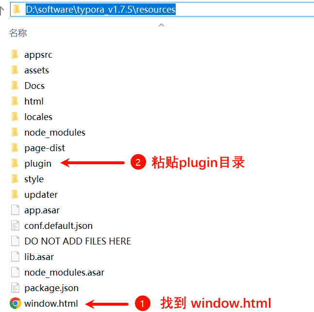 | 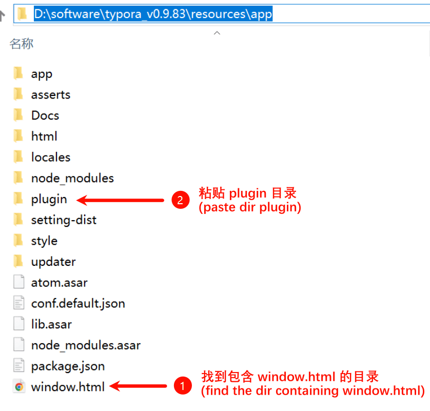 |

|        | Windows                                        | Linux                                      |
| ------ | ---------------------------------------------- | ------------------------------------------ |
| 步骤 4 | 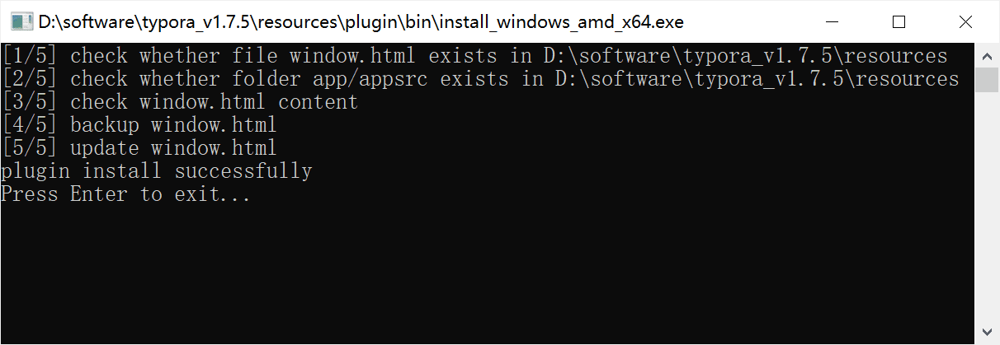 | 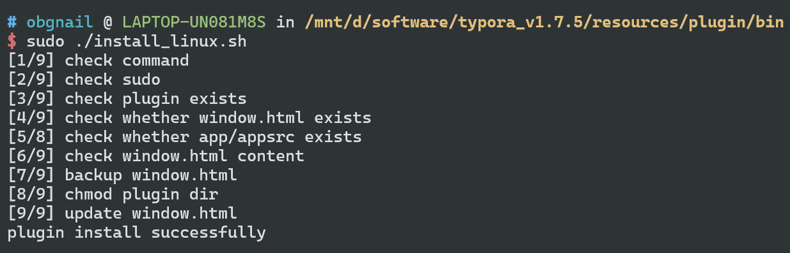 |

附加说明：

- Windows 系统也可以通过执行 `install_windows.ps1` 安装插件；同理，Linux 系统也可以执行 `install_linux_amd_x64` 文件
- 每个插件皆有配置选项。开发者鼓励您修改配置，以符合自身需求。配置文件夹位于 [A/plugin/global/settings/](https://github.com/obgnail/typora_plugin/tree/master/plugin/global/settings)


## 如何使用：方法二（手动）

> 此方法支持 Windows、Linux 平台。

1. [下载](https://github.com/obgnail/typora_plugin/releases/latest) 插件源码的压缩包，并将其解压

2. 进入 Typora 安装路径，找到包含 `window.html` 的文件夹 A（正式版的路径为 `./resources/window.html`，免费版的路径为 `./resources/app/window.html`）

3. 将解压后的 plugin 文件夹粘贴进文件夹 A 下（参考方法一的图片）

4. 根据文件夹 A 下是否含有 `appsrc` 目录判断 Typora 是否为新版本，有则新版本，无则旧版本

5. 打开文件 `A/window.html`

   - 若是新版本：搜索文件内容 `<script src="./appsrc/window/frame.js" defer="defer"></script>`

   - 若是旧版本：搜索文件内容 `<script src="./app/window/frame.js" defer="defer"></script>`

   在上述搜索内容的 **后面** 加入 `<script src="./plugin/index.js" defer="defer"></script>`

6. 验证：重启 Typora，在正文区域点击鼠标右键，弹出右键菜单栏，如果能看到 `常用插件` 栏目，说明一切顺利

> 如果您安装失败，大概率是权限问题导致的。请给上述的 plugin 文件夹授权。


|        | 新版本                                               | 旧版本                                           |
| ------ | ---------------------------------------------------- | ------------------------------------------------ |
| 步骤 5 | 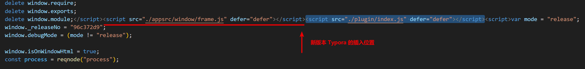 | 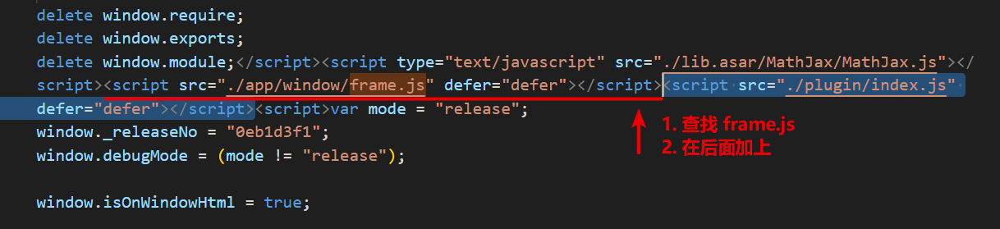 |


## 如何使用：方法三（自动）

> 目前此方法仅限 archlinux 平台，aur 见 [aur/typora-plugin](https://aur.archlinux.org/packages/typora-plugin)

```
yay -S typora-plugin
```


## Q&A

### 我的 Typora 版本能用吗？

所有插件都在 0.9.98 版本（最后一个免费版本）和最新版本测试过。本项目理论上支持所有 Typora 版本，但是 Typora 在 0.9.98 版本以后功能才稳定下来。**0.9.98 版本以下，可能会因为缺少某些功能导致部分插件失效**。


### 插件会失效吗？

理论上能保持长时间有效，且我在维护中。


### 如何永久禁用/启用某些插件？

右键菜单 -> 少用插件 -> 启停插件。


### 如何修改插件配置？

目前整个项目包含 600+ 配置选项，可以比较完整的定义各个插件的行为。

这些配置全部位于 [./plugin/global/settings/](https://github.com/obgnail/typora_plugin/tree/master/plugin/global/settings) 目录中。修改配置的方法请阅读该目录下的 [请读我.md](https://github.com/obgnail/typora_plugin/blob/master/plugin/global/settings/%E8%AF%B7%E8%AF%BB%E6%88%91.md)。


### 如何升级插件？

右键菜单 -> 常用插件 -> 二级插件 -> 升级插件。


### 我不想用了，如何卸载插件系统？

右键菜单 -> 少用插件 -> 帮助 -> 卸载插件。


### 支持 Typora for Mac 吗？

没有 Mac，故没做测试。


## 插件使用说明

所有的插件都提供了四种使用方法：

- 键盘党：
  - 键入 ctrl+j，在输入框键入 `plu+空格+插件名称` 调出插件列表（详见 `toolbar` 插件）
  - 快捷键（详见 `hotkeys` 插件）
- 鼠标党：
  - 在正文区域右键，在弹出的右键菜单中直接调用（详见 `right_click_menu` 插件）
  - 快捷按钮（详见 `quickButton` 插件）


### window_tab：标签页管理

- `切换标签`：标签页处 Ctrl+滚轮滚动、ctrl+shift+tab、ctrl+tab、ctrl+PgUp、ctrl+PgDn
- `关闭标签`：ctrl+w、鼠标中键
- `新窗口打开`：ctrl+单击标签
- `排序标签`：拖拽
- `弹出标签的菜单选项`：右键单击标签页

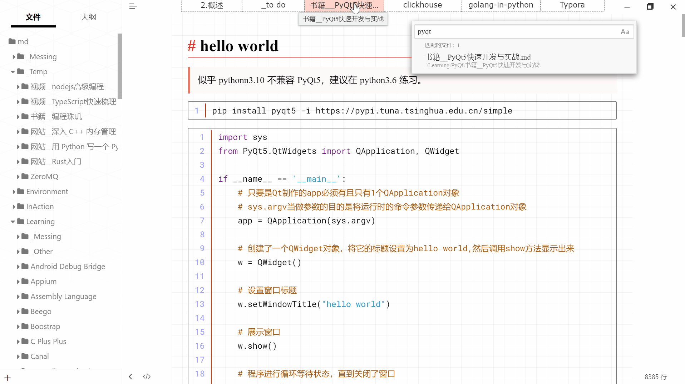


### search_multi：多关键字搜索

功能：比如搜索同时包含 `golang` 和 `install` 和 `生命周期` 三个关键字的文件。

- `打开搜索框`：ctrl+shift+P
- `关闭搜索框`：光标定位到输入框，键入 esc
- `搜索`：enter
- `选中`：ArrowUp，ArrowDown
- `打开`：click、ctrl+enter
- `移动位置`：ctrl+拖动输入框


### multi_highlighter：多关键字高亮

功能：搜索并高亮关键字，并提供一键定位功能（左键下一个，右键上一个）

> 关键字使用空格分隔，双引号包裹视为词组。

- `打开搜索框`：ctrl+shift+H
- `关闭搜索框`：光标定位到输入框，键入 esc
- `搜索`：enter
- `移动位置`：ctrl+拖动输入框
- `定位到下一个关键字`：左键色块
- `定位到上一个关键字`：右键色块

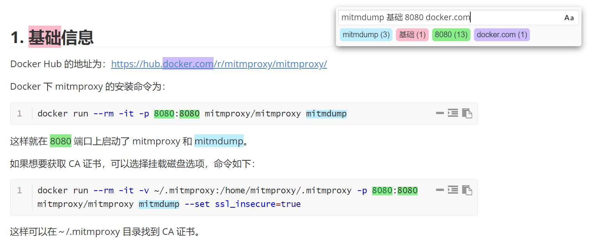


### collapse_paragraph：章节折叠

功能：折叠 / 展开 章节下所有文本。支持折叠的标签：h1~h6。

- `折叠/展开单个章节`：ctrl+click
- `折叠/展开父章节下所有同级的章节`：ctrl+alt+click
- `折叠/展开所有同级的章节`：ctrl+shift+alt+click

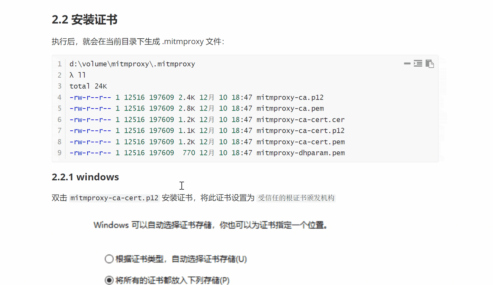


### collapse_list：列表折叠

功能：折叠 / 展开 无序列表、有序列表、任务列表。


### collapse_table：表格折叠

功能：折叠 / 展开 表格。


### md_padding：中英文混排优化

功能：中英文混排时，中文与英文之间、中文与数字之间添加空格。

快捷键：ctrl+shift+B

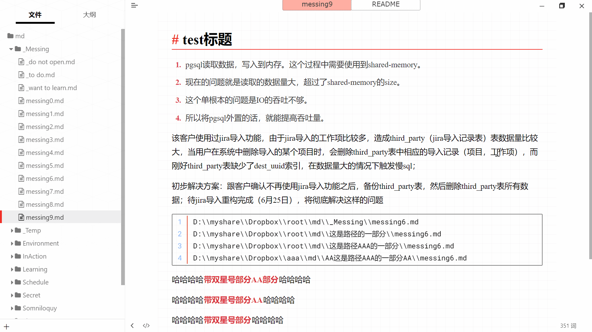


### slash_commands：斜杠命令

功能：类似于 notion 的 slash command。

支持用户自定义命令，请前往配置文件修改：

```toml
[slash_commands]
COMMANDS = [
    { enable = true, type = "snippet", icon = "🧰", hint = "", keyword = "snippet", callback = "thisIsTestSnippet" },
    { enable = true, type = "command", icon = "🧾", hint = "二级标题", keyword = "h2", callback = "() => File.editor.stylize.changeBlock('header2', undefined, true)" },
    { enable = true, type = "command", icon = "🧰", hint = "置底部", keyword = "jumpBottom", callback = "() => File.editor.selection.jumpBottom()" },
    ...
]
```


### templater：文件模板功能

功能：类似于 obsidian 的文件模板功能，根据模板快速创建文件。

使用方式：右键菜单 -> 常用插件 -> 二级插件 -> 文件模板。

> 模板列表请前往配置文件修改。


### resourceOperation：一键清除无用图片

功能：资源管理，清除无用图片

使用方式：右键菜单 -> 常用插件 -> 二级插件 -> 资源管理


### fence_enhance：复制，折叠，格式化代码

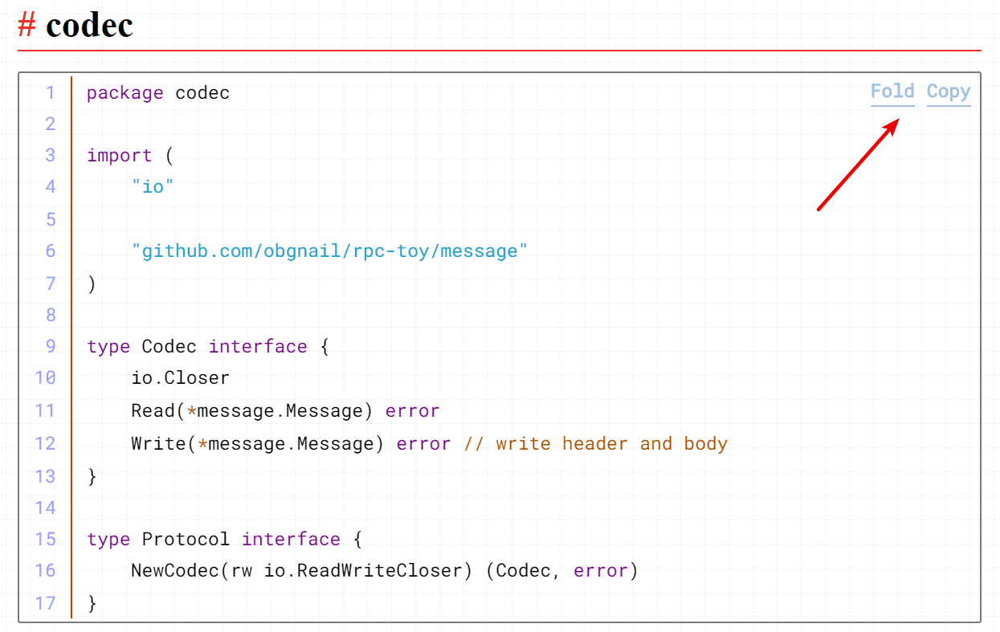


### toc：在右侧生成大纲目录

功能：Typora 侧边栏的【文件】和【大纲】不能同时显示，为了解决此问题，此插件会在右侧新增一个【大纲】。

使用方式：

- 方式一：常用插件 -> 二级插件 -> 大纲目录
- 方式二：右键点击侧边栏的【大纲】按钮


### commander：命令行环境

功能：和 total commander 的命令行一样（快捷键也一样），一个快速执行命令的工具，并提供少量交互。

- `弹出执行框`：ctrl+G
- `关闭执行框`：esc
- `移动位置`：ctrl+拖动输入框

支持 shell：

- `cmd/bash`：windows 或 Mac 的默认终端
- `powershell`：微软的傻儿子 :D
- `git bash`：使用此终端前请保证安装了 git bash 并且加入环境变量
- `wsl`：使用此终端前请保证安装了 wsl2，并且加入环境变量

内置环境变量：

- `$f`：当前文件路径
- `$d`：当前文件的所属目录
- `$m`：当前挂载的根目录

支持内建命令，方便快速调用。个人可按需自定义配置文件里的 `BUILTIN` 选项。

```toml
# 默认的内建命令
# 目前支持4个参数:
#   1. name:   展示的名称（不可重复）
#   2. shell:  cmd/bash、powershell、gitbash、wsl
#   3. hotkey: 快捷键（可选）
#   4. cmd:    执行的命令
BUILTIN = [
    { name = "", shell = "cmd/bash", cmd = "" },
    { name = "Explorer", shell = "powershell", hotkey = "ctrl+alt+e", cmd = "explorer $d" },
    { name = "Vscode", shell = "cmd/bash",  cmd = "code $f" },
    { name = "WT", shell = "cmd/bash",  cmd = "cd $d && wt" },
    { name = "GitCommit", shell = "cmd/bash",  cmd = 'cd $m && git add . && git commit -m "update"' },
]
```


### markmap：提供 markmap 支持

使用方式：

- 方式一：右键菜单 -> 少用插件 -> markmap
- 方式二：直接点击右下角的 markmap 按钮

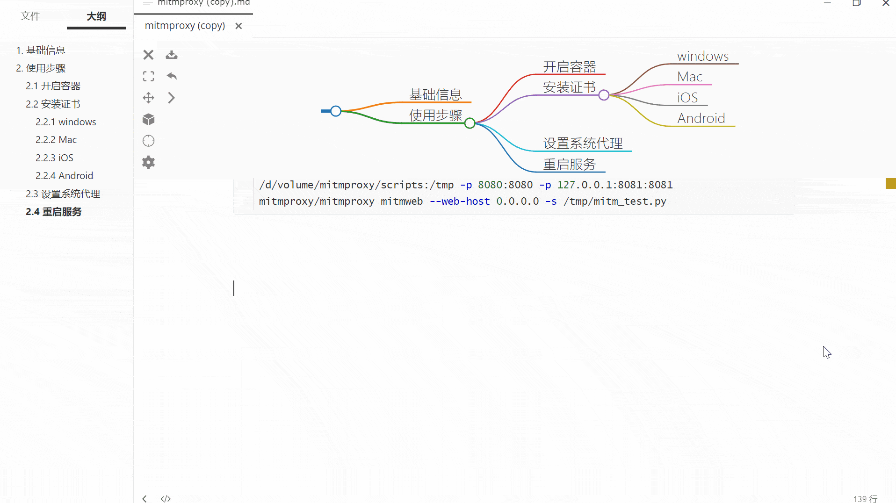


### toolbar：多功能搜索

功能：类似于 vscode 的 ctrl+shift+p 功能

使用方式：

- 方式一：右键菜单 -> 少用插件 -> 多功能搜索
- 方式二：快捷键 `ctrl+j`

支持搜索：

- `his`：最新打开过的文件
- `plu`：插件
- `tab`：打开的标签页
- `ops`：常用操作
- `out`：文档大纲
- `mode`：切换文件模式
- `theme`：临时切换主题
- `func`：功能列表
- `all`：混合查找（所有项目都混在一起查找）

键入内容说明：

- 键入内容 = 搜索工具名称 + 空格 + 搜索内容
- 支持 `交集查询`、`差集查询`，并且可以随意组合（类似于 google 的正负向查询）

举例：

- `his node learn`：查找最近打开的文件，要求文件标题【包含 node 和 learn 两个关键字】
- `plu multi -search`：查找插件，要求插件名【包含 multi 关键字，但是不包含 search 关键字】
- `tab -messing`：查找所有打开的标签页，要求标签页名称【不包含 messing 关键字】
- `his close -win -mark 标签`：查找最近打开的文件，要求文件标题【包含 close、标签，不包含 win、mark】

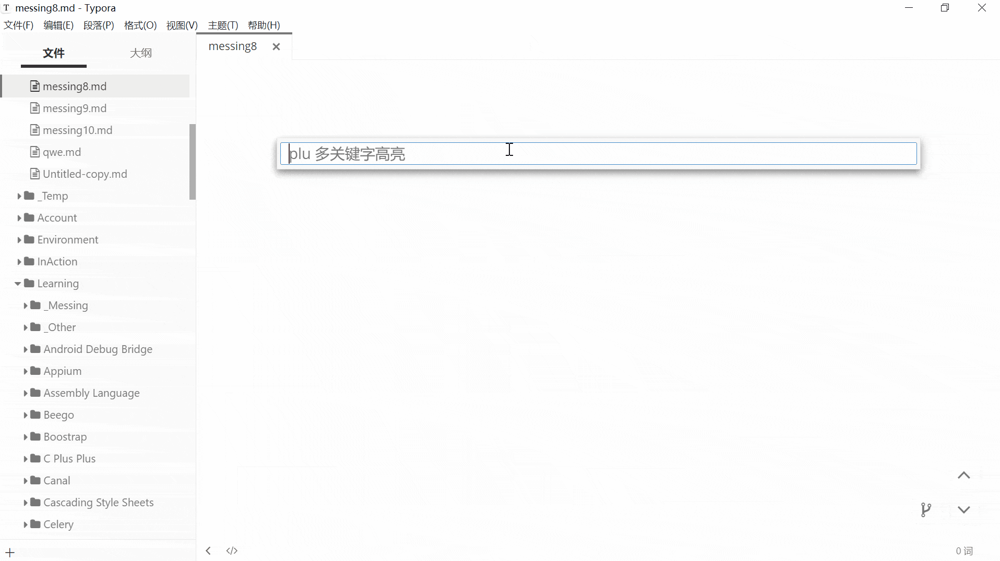


### right_click_menu：右键菜单统一管理插件

所有插件都支持在右键菜单中直接调用。鼠标党可以将右键菜单作为所有插件的主要调用方式。

可以通过修改配置文件自定义右键菜单：

```toml
#  每一个MENUS对应一个一级菜单，允许无限添加一级菜单，允许重复添加同一个插件
#  NAME: 一级菜单的名称
#  LIST: 二级菜单的插件列表（使用"---"代表在页面上插入一个divider，以作分隔）
[[right_click_menu.MENUS]]
NAME = "少用插件"
LIST = [
    "window_tab",
    "fence_enhance",
    "auto_number",
    "datatables",
    "resize_image",
    "resize_table",
    "collapse_list",
    "collapse_table",
    "truncate_text",
    "export_enhance",
    "cipher",
    "right_click_menu",
    "help",
    "---",
    "pie_menu",
    "go_top",
    "text_stylize",
    "slash_commands",
    "ripgrep",
    "article_uploader",
    "preferences",
    "---",
    "file_counter",
    "json_rpc",
    "test",
]
[[right_click_menu.MENUS]]
NAME = "常用插件"
LIST = [
    "commander",
    "markmap",
    "collapse_paragraph",
    "easy_modify",
    "custom",
    "---",
    "toolbar",
    "search_multi",
    "multi_highlighter",
    "md_padding",
    "read_only",
    "blur",
]
```


### pie_menu：圆盘菜单

使用方式：

- `弹出圆盘菜单`：Ctrl+鼠标右键
- `旋转圆盘菜单`：鼠标中键
- `固定圆盘菜单，圆盘不再自动消失`：鼠标左键圆心
- `展开圆盘菜单，圆盘不再自动收缩`：鼠标右键圆心


### preferences：启停插件

使用方式：右键菜单 -> 少用插件 -> 启停插件


### echarts：提供 echarts 支持

使用方式：右键菜单 -> 常用插件 -> 二级插件 -> Echarts

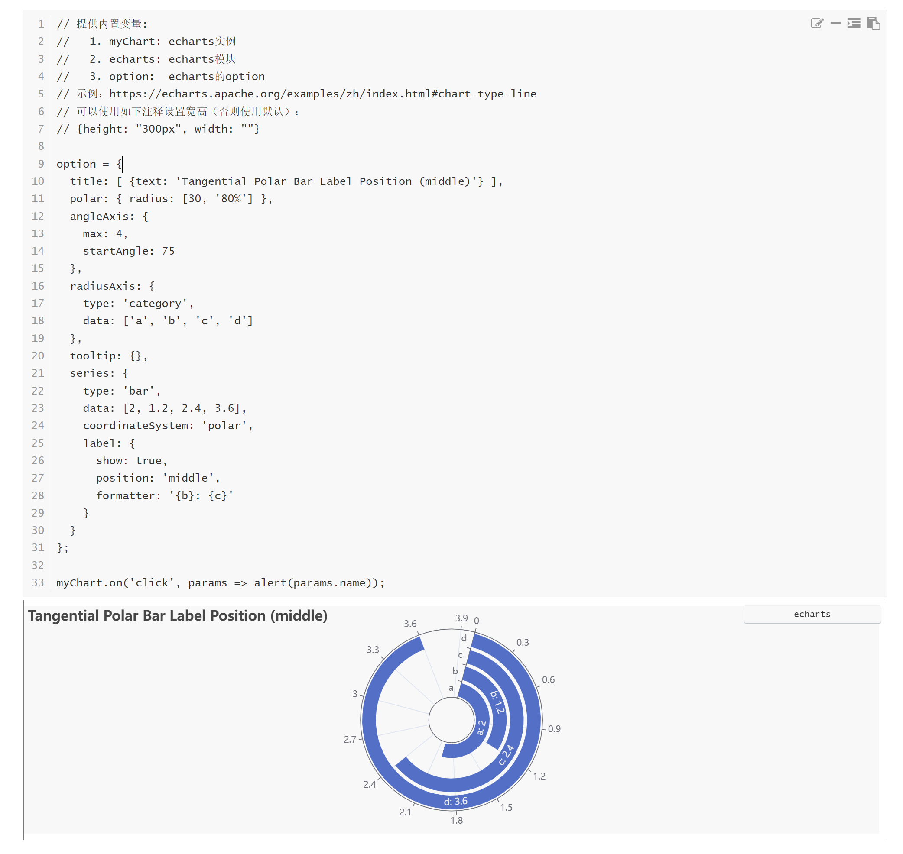


### chart：提供 chartjs 支持

使用方式：右键菜单 -> 常用插件 -> 二级插件 -> Chart

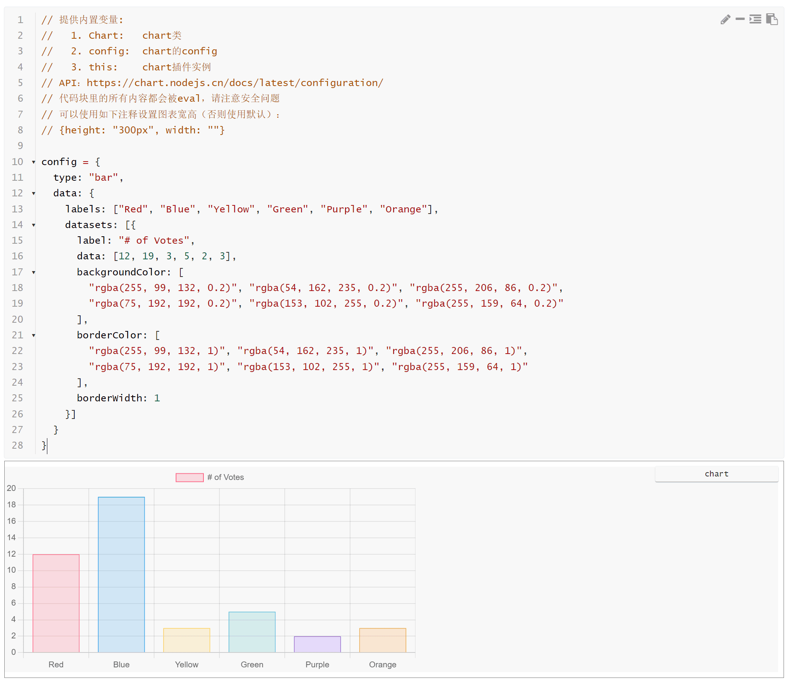


### abc：提供 abc 组件支持

使用方式：右键菜单 -> 常用插件 -> 二级插件 -> ABC

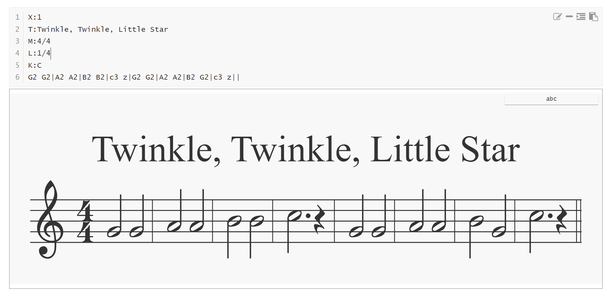


### calendar：  提供 tui.calendar 组件支持

使用方式：右键菜单 -> 常用插件 -> 二级插件 -> Calendar


### wavedrom：提供 wavedrom 组件支持

使用方式：右键菜单 -> 常用插件 -> 二级插件 -> Wavedrom

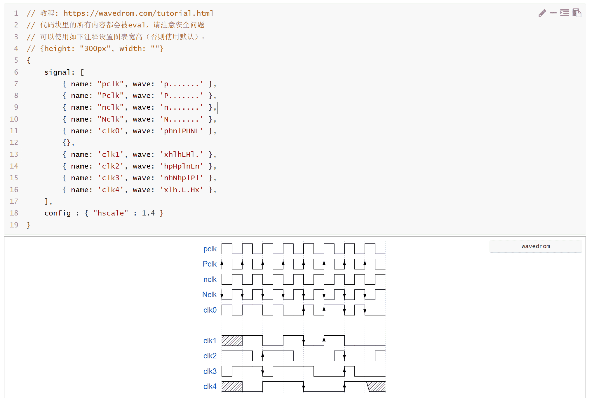


### marp：提供 marp 组件支持

功能：使用 markdown 做 PPT。

使用方式：右键菜单 -> 常用插件 -> 二级插件 -> Marp


### callouts：  提供 callouts 支持

使用方式：右键菜单 -> 常用插件 -> 二级插件 -> Callouts

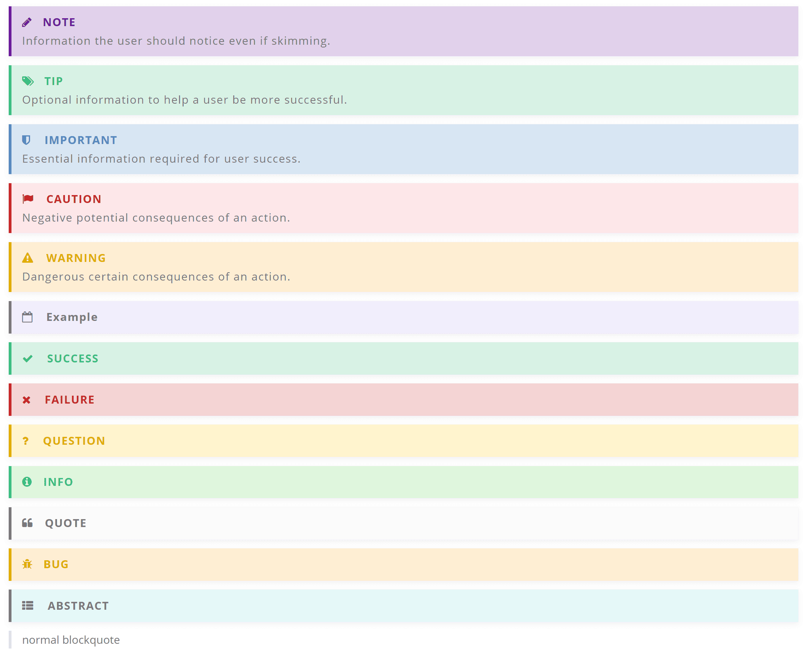

数量、类型、颜色、icon 皆可自己定义，请前往配置文件修改：

```toml
[[callouts.config.list]]
type = "note"
background_color = "#e1d1eb"
left_line_color = "#6a1b9a"
icon = "\\f040"
```


### kanban：看板

拓展代码语法，添加看板功能。

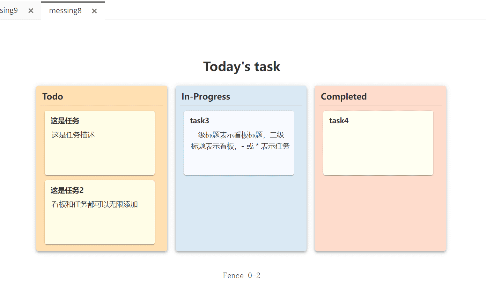


### timeline：时间线

拓展代码语法，添加时间线功能。

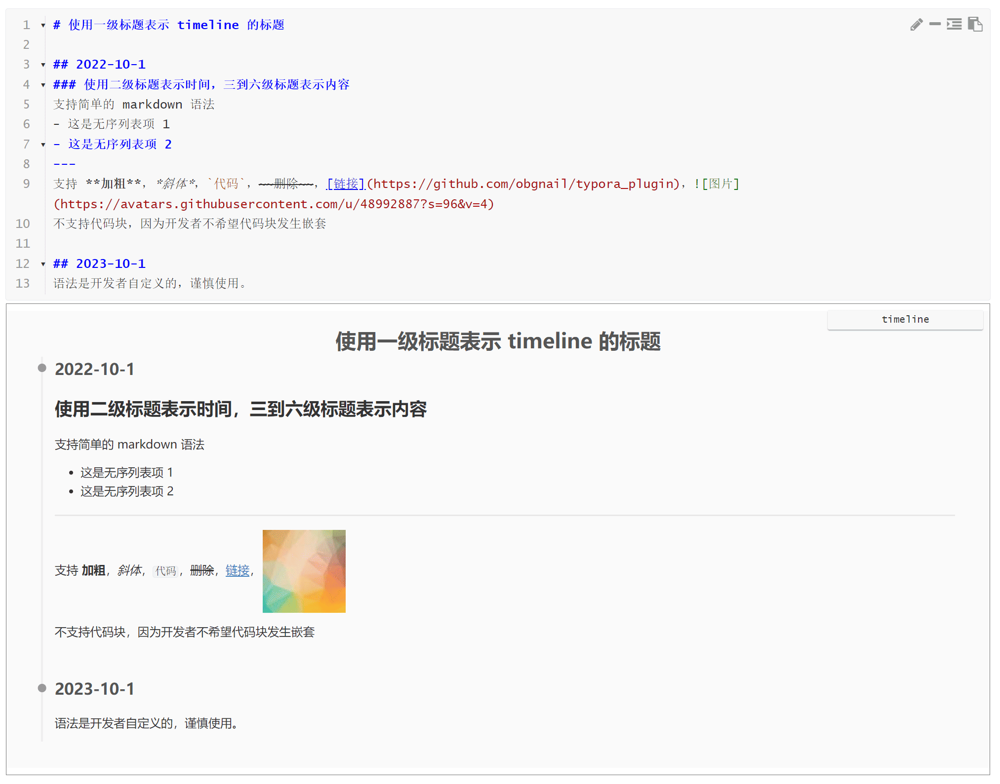


### chat：聊天

拓展代码语法，添加聊天功能。

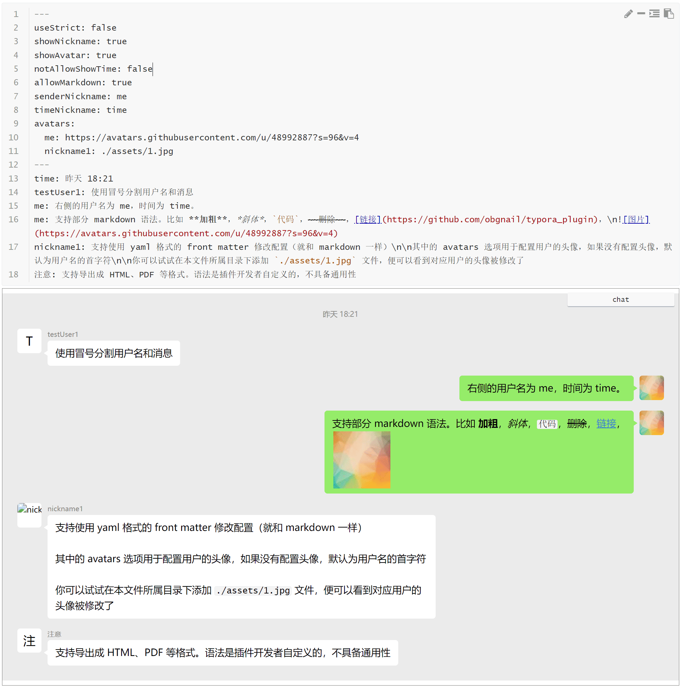


### text_stylize：文字风格化

功能：将文字转为 html 格式，改变文字样式。

使用方式：右键菜单 -> 少用插件 -> 文字风格化。

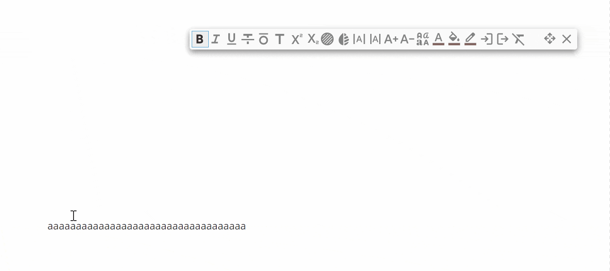


### read_only：只读模式

功能：只读模式下文档不可编辑（开启后，右下角数字统计区域会出现 `ReadOnly` 字样）

快捷键：ctrl+shift+R


### blur：模糊模式

功能：开启后，只有当前聚焦的组件可见，其余模糊。可以用于防偷窥。

使用方式：右键菜单 -> 少用插件 -> 模糊模式

> 此插件只能于正式版 Typora 使用。


### file_counter：显示文件数

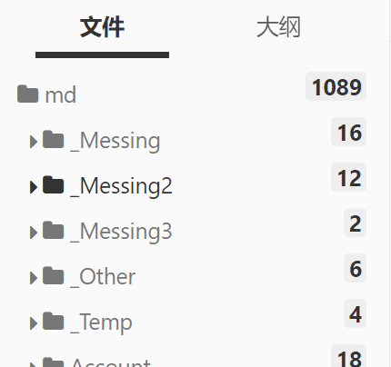


### auto_number：自动编号

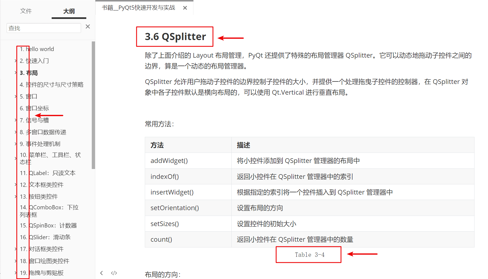

> 注意：通过注入 CSS 实现此功能，有可能会与你使用的 theme 冲突。

> 和其他使用 Theme CSS 的实现方式不同，此插件通过修改内置函数，完美解决导出 PDF 后侧边栏没有编号的问题 :)

> 根据 [Markdown 最佳实践](https://learn.microsoft.com/en-us/powershell/scripting/community/contributing/general-markdown?view=powershell-7.3)，一篇文档应该 **有且仅有** 一个 h1，故此插件从 h2 开始编号。


### imageReviewer：图片查看器

功能：一站式图片查看，并且提供简单图片编辑。

使用方式：

- 方式一：点击右下角【查看图片】按钮
- 方式二：右键菜单 -> 常用插件 ->  二级插件 -> 图片查看器

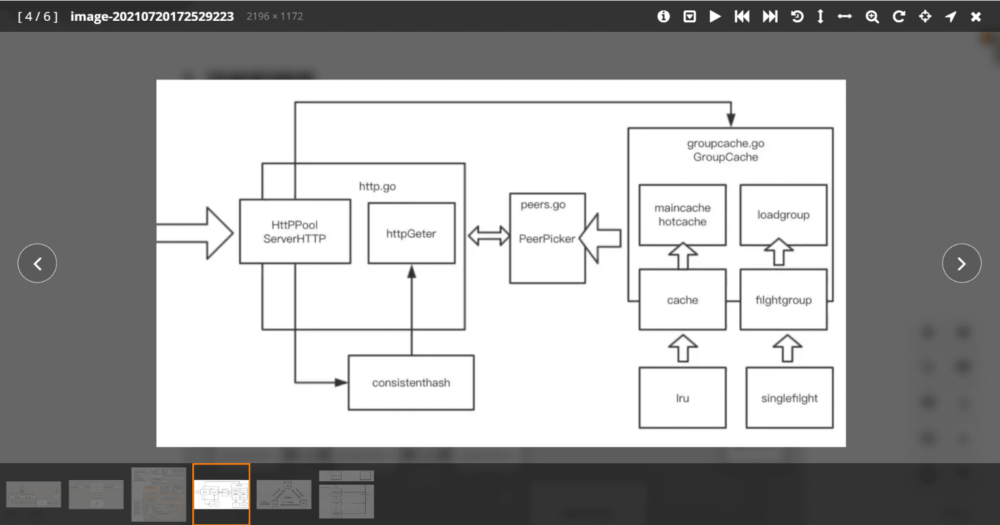


### chineseSymbolAutoPairer：中文符号自动补全

功能：输入 `《 【 （ ‘ “ 「` 符号时自动补全。


### datatables：表格增强

功能：增强表格。提供搜索、过滤、分页、排序等功能。

> 使用方式：将光标定位在表格 -> 右键菜单 -> 少用插件 ->  表格增强。

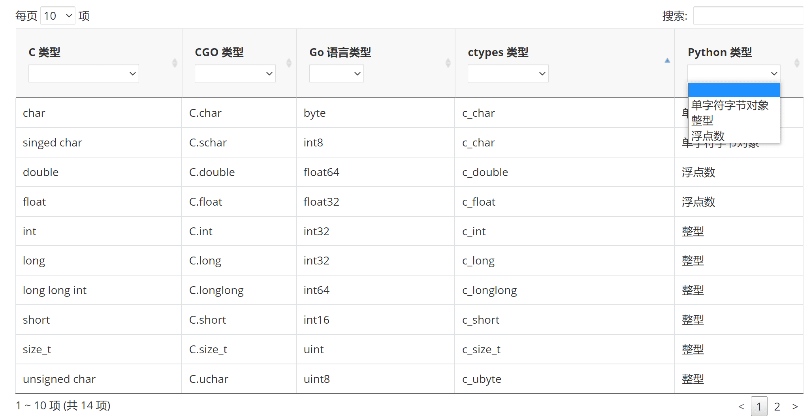


### resize_table：拖动调整表格大小

功能：`ctrl+鼠标拖动`：修改表格的行高列宽。

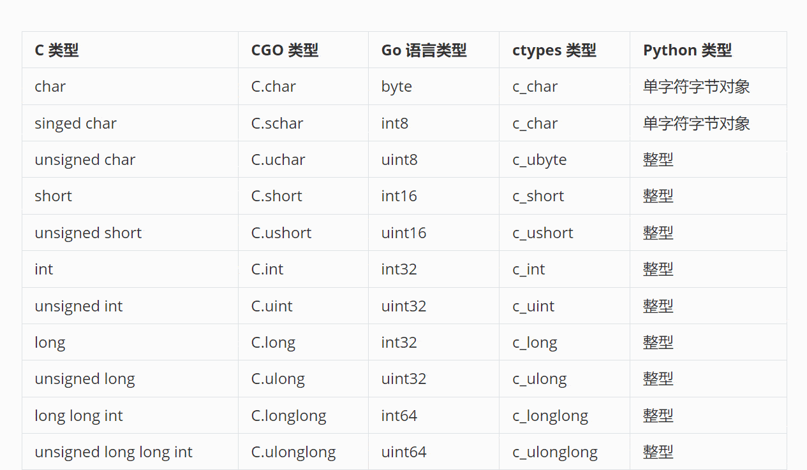


### resize_image：调整图片大小

功能：`alt+鼠标滚轮滚动`：调整图片大小。


### export_enhance：导出增强

功能：导出 html 时，将图片转为 base64，避免图片丢失。


### go_top： 一键到顶

功能：在右下角添加一个一键到顶的按钮。


### reopenClosedFiles：打开上次退出 Typora 时尚未关闭的标签页

功能：自动 或者 通过快捷键打开上一次退出 Typora 时尚未关闭的标签页

> 此插件仅在 window_tab 启用时生效。


### dark：夜间模式

使用方式：右键菜单 -> 常用插件 -> 夜间模式


### no_image：无图模式

使用方式：右键菜单 -> 常用插件 -> 无图模式


### pluginUpdater：一键升级插件

使用方式：右键菜单 -> 常用插件 -> 二级插件 ->  升级插件。

> 众所周知，有些用户并不能裸连 github 下载最新插件，故提供了设置代理功能（默认为系统代理）


### easy_modify：编辑工具

使用方式：右键菜单 -> 常用插件 -> 编辑工具

本插件是常用的编辑工具集合，目前包括：

1. 复制标题路径
2. 根据文档大纲一键生成思维导图：mindmap
3. 根据文档大纲一键生成思维导图：graph
4. 提升选中文段的标题等级
5. 降低选中文段的标题等级
6. 提取选区文字到新文件
7. 添加结尾空格


### editor_width_slider：写作区宽度调整

使用方式：右键菜单 -> 少用插件 -> 写作区宽度调整

功能：调整写作区的宽度


### redirectLocalRootUrl：重定向本地资源根目录

功能：如果你主要使用 obsidian 或 joplin 来管理文件，偶尔用 typora 打开文件。就会遇到一个问题：obsidian 或 joplin 都是将本地资源放在同一个目录中（vault），这导致在 typora 打开后文件由于路径错误，无法访问本地资源。此插件就是为了解决此问题，重定向本地资源根目录。

> 此插件默认关闭，需手动开启。

使用此插件前需要设置如下配置选项：

```toml
# 资源根目录，支持绝对路径(如D:\\tmp\\img)和相对路径(如.\\assets)，填写时请注意转义反斜线（若为空，则此插件失效）
root = "./"
# 过滤的正则表达式：只有文件路径命中filter_regexp匹配的文件才使用此插件（若为空，则全部文件都使用此插件）
filter_regexp = ""
```


### blockSideBySide：并列显示活动块

功能：活动块默认是上下显示，改为并列显示。

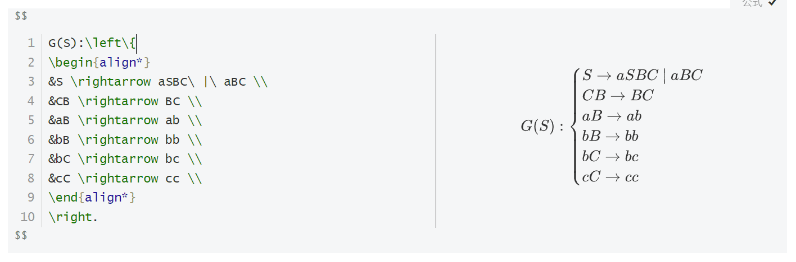

> 注意：通过注入 CSS 实现此功能，有可能会与你使用的 theme 冲突。


### openInTotalCommander：在 total commander 打开当前文件

使用方式：将光标定位到标题上 -> 右键菜单 -> 常用插件 -> 二级插件 ->  TC 打开。

> 此插件默认关闭，需手动开启。使用此插件前，需要您在配置手动修改 TC 的安装路径。


### scrollBookmarker： 书签管理器

使用方式：

1. 使用 alt+click 正文内容，打上书签。
2. 此时会自动调出书签管理器，点击上面的书签，即可跳转到书签。

显示/隐藏书签管理器：右键菜单 -> 常用插件 -> 二级插件 -> 书签管理器


### help：  用户帮助

使用方式：右键菜单 -> 少用插件 -> 帮助。


### cipher：加密文件

使用方式：右键菜单 -> 少用插件 -> 加密文件。


### truncate_text：暂时隐藏内容，提高大文件渲染性能

功能：大文件在 Typora 的渲染性能很糟糕，用此插件暂时隐藏内容（只是隐藏显示，不修改文件），提高渲染性能。也可以用于防偷窥。

使用方式：右键菜单 -> 少用插件 -> 文本截断。

包含的功能如下：

- 隐藏最前面：隐藏最前面的文本段，只留下最后 80 段。
- 重新显示：重新显示之前隐藏的所有文本段。
- 根据当前可视范围显示：根据当前可视范围显示文本段。

> 原理：通过设置 DOM 元素的 display 样式为 none 来隐藏元素，让元素不占用渲染树中的位置，对隐藏的元素操作不会引发其他元素的重排。

> collapse_paragraph （章节折叠功能）可以很好的替代此插件，建议使用 collapse_paragraph。


### ripgrep：使用 ripgrep 搜索文件

Typora 自带 ripgrep。此插件支持使用内建的 ripgrep 进行文件搜索。

> 使用此插件需要您熟悉 ripgrep 工具。此插件默认关闭，需手动开启。


### hotkeys：快捷键注册中心（高级）

> 此插件是高级插件，仅对有 javascript 基础的用户开放。

功能：以声明的形式，为【任意插件系统函数】或【任意自定义函数】绑定快捷键。

具体使用请参考 [hotkey.default.toml](https://github.com/obgnail/typora_plugin/blob/master/plugin/global/settings/hotkey.default.toml)。


### quickButton：于右下角添加功能按钮（高级）

> 此插件是高级插件，仅对有 javascript 基础的用户开放。

功能和 hotkeys 类似，以声明的形式，为【任意插件系统函数】设置快捷按钮。


### custom：开放平台，用户自定义插件（高级）

> 此插件是高级插件，仅对有 javascript 基础的用户开放。

功能：提供开放能力，支持用户自己写插件。

具体使用请参考 [请读我.md](https://github.com/obgnail/typora_plugin/blob/master/plugin/custom/%E8%AF%B7%E8%AF%BB%E6%88%91.md)。


### json_rpc：外部操纵 Typora（高级）

功能：将包括 typora-plugin 所有功能在内的一切能力通过 `json-rpc` 的形式暴露出去，以供外部操纵 Typora。

具体使用请参考 [请读我.md](https://github.com/obgnail/typora_plugin/blob/master/plugin/json_rpc/%E8%AF%B7%E8%AF%BB%E6%88%91.md)。

> 此插件是高级插件，仅对开发人员开放。开启此插件后，外部将拥有 node、browser 两套环境，能完全控制电脑，因此如果您不是开发人员，请勿开启此插件。
>


### article_uploader：上传博客文章

功能：用户点击或者使用快捷键触发当前文章的自动发布功能，程序根据用户配置自动发布博客文章到各大平台

具体使用参考： [请读我.md](https://github.com/obgnail/typora_plugin/blob/master/plugin/article_uploader/%E8%AF%B7%E8%AF%BB%E6%88%91.md)。以上传到 CSDN 为例，Gif 图如下：


## 致谢

- Apache：[ECharts](https://echarts.apache.org/zh/index.html)
- MIT：[markmap](https://markmap.js.org/) | [Chart.js](https://www.chartjs.org/) | [abcjs](https://github.com/paulrosen/abcjs) | [tui.calendar](https://github.com/nhn/tui.calendar) | [Marp](https://marp.app/) | [WaveDrom](https://wavedrom.com/) | [DataTables](https://github.com/DataTables/DataTables) | [markdownlint](https://github.com/DavidAnson/markdownlint)
- no-licence：[typora-tabbar-plugin](https://github.com/gatziourasd/typora-tabbar-plugin) | [typora-side-by-side](https://github.com/gruvw/typora-side-by-side) | [md-padding](https://github.com/harttle/md-padding)


## 结语

本人并非前端开发，前端技术全靠 Google，JS/CSS 写的很烂。

**本项目遵循 MIT 协议，请自由地享受。**

如果对各位有用的话，欢迎 star ⭐，欢迎推荐给你志同道合的朋友使用。

