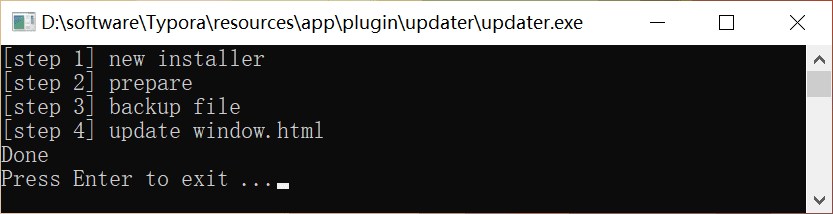
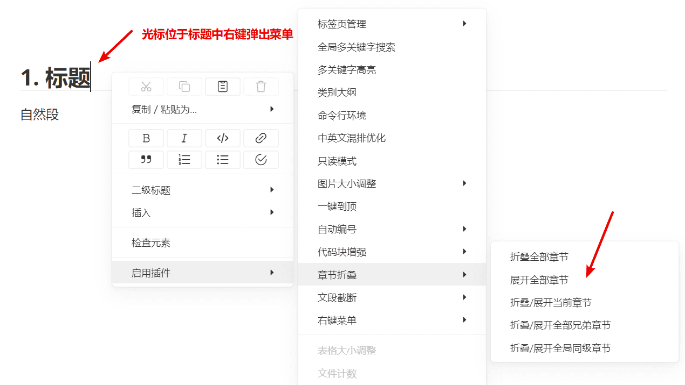
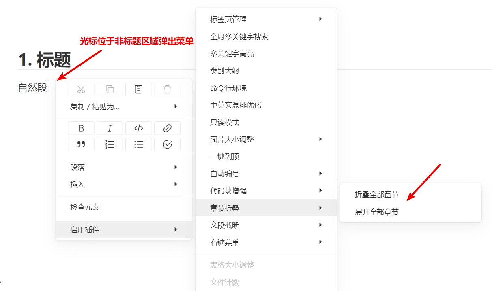
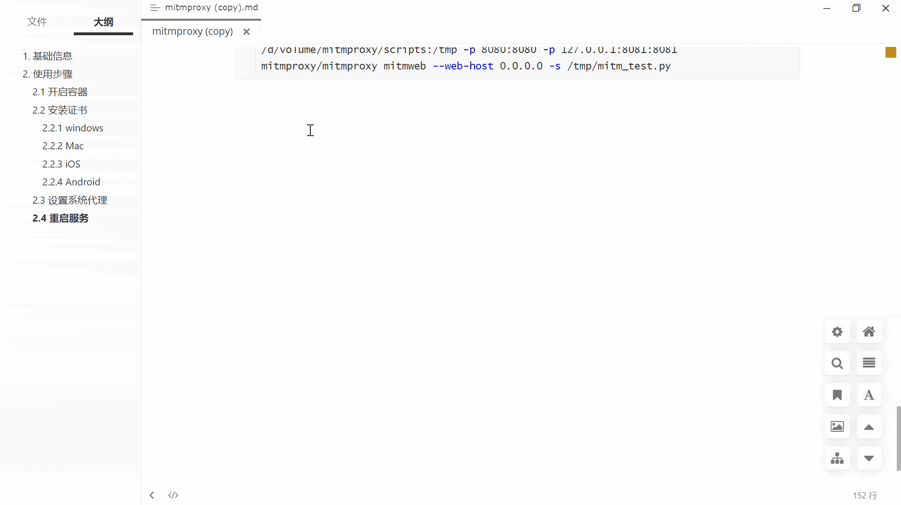
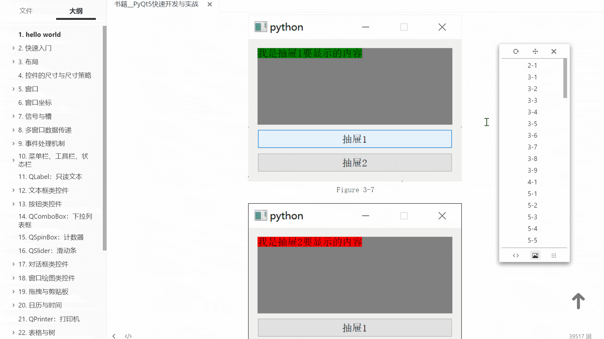
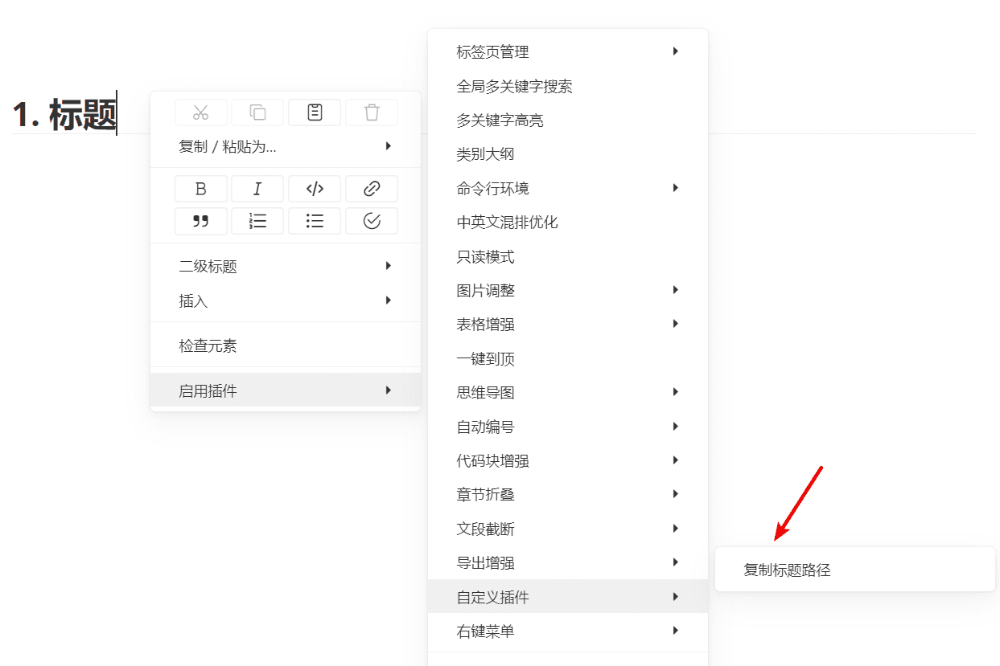

# Typora Plugin

<div align="center">
  
</div>

目前支持的功能：

| 序号 | 文件名             | 功能                                 | 默认开启 |
| ---- | ------------------ | ------------------------------------ | -------- |
| 1    | window_tab         | 标签页管理                           | √        |
| 2    | search_multi       | 全局多关键字搜索                     | √        |
| 3    | multi_highlighter  | 多关键字高亮                         | √        |
| 4    | collapse_paragraph | 章节折叠                             | √        |
| 5    | md_padding         | 中英文混排优化                       | √        |
| 6    | templater          | 文件模板                             | √        |
| 7    | resource_operation | 一键清除无用图片，生成报告           | √        |
| 8    | fence_enhance      | 一键复制代码，折叠代码               | √        |
| 9    | commander          | 命令行环境                           | √        |
| 10   | mindmap            | 根据文档大纲一键生成思维导图         | √        |
| 11   | read_only          | 只读模式                             | √        |
| 12   | blur               | 模糊模式                             | √        |
| 13   | kanban             | 看板                                 | √        |
| 14   | file_counter       | 显示目录下的文件数                   | √        |
| 15   | outline            | 以表格、图片、代码块形式的大纲       | √        |
| 16   | auto_number        | 章节、表格、图片、代码块等自动编号   | √        |
| 17   | datatables         | 表格增强（搜索、过滤、分页、排序等） | √        |
| 18   | resize_table       | 调整表格行高列宽                     | √        |
| 19   | resize_image       | 调整图片显示大小                     | √        |
| 20   | export_enhance     | 导出 html 时避免图片丢失             | √        |
| 21   | go_top             | 一键到文章顶部                       | √        |
| 22   | truncate_text      | 暂时隐藏内容，提高大文件渲染性能     | √        |
| 23   | custom             | 用户自定义命令（高级）               | √        |
| 24   | plugin_updater     | 一键更新插件                         | √        |
| 25   | right_click_menu   | 右键菜单统一管理、调用插件           | √        |
| 26   | mermaid_replace    | 替换 mermaid 组件                    | ×        |
| 27   | old_window_tab     | 标签页管理（已废弃）                 | ×        |

> 如果各位有其他的需求，或发现 BUG，欢迎提 issue。如果能给我颗 star ⭐ 就更好了  : )


## 如何使用：方法一（自动）

> 目前此方法仅限 windows 平台。

1. [下载](https://github.com/obgnail/typora_plugin/releases)插件源码。

2. 进入 Typora 安装路径，找到包含 `window.html` 的文件夹 A。（一般是 `Typora/resources/window.html` 或者  `Typora/resources/app/window.html`）

3. 打开文件夹 A，将源码的 plugin 文件夹粘贴进该文件夹下。（参考方法二的图片）

4. 进入文件夹 `A/plugin/updater/`，双击运行 `updater.exe`。如果看到下图，说明成功。

   

5. 验证：重启 Typora，在正文区域点击鼠标右键，弹出右键菜单栏，如果能看到【启用插件】栏目，说明一切顺利。

> NOTE：`updater.exe` 同时集成了 install 和 update 两个功能，后续更新插件需要用到此文件，请勿移动位置、删除。如果您不信任此 exe 文件，请自行编译此目录下的 `updater.go` 文件。


---


## 如何使用：方法二（手动）

1. [下载](https://github.com/obgnail/typora_plugin/releases)插件源码。
2. 进入 Typora 安装路径，找到包含 `window.html` 的文件夹 A。（一般是 `Typora/resources/window.html` 或者  `Typora/resources/app/window.html`，推荐使用 everything 找一下）
3. 打开文件夹 A，将源码的 plugin 文件夹粘贴进该文件夹下。
4. 打开文件 `A/window.html`。搜索文件内容 `<script src="./app/window/frame.js" defer="defer"></script>` 或者 `<script src="./appsrc/window/frame.js" defer="defer"></script>`，并在 **后面** 加入 `<script src="./plugin/index.js" defer="defer"></script>`。保存。
6. 验证：重启 Typora，在正文区域点击鼠标右键，弹出右键菜单栏，如果能看到【启动插件】栏目，说明一切顺利。


### 新版本操作

> 根据文件夹 A 下是否有 `appsrc` 目录判断是否为新版本，有则新版本，无则旧版本。


### 旧版本操作


> 虽然操作简单，还请务必对照上图谨慎操作。如果修改完 Typora 白屏了，很可能是你修改的时候疏忽了。


## 实现原理

### 前端

`window.html` 是 Typora 的初始文件，可以写入一个 `<script>` 标签实现功能。就和 Tampermonkey 脚本一样。


### 后端

1. 因为 Typora 暴露了 `reqnode` 函数（require 的封装），所以可以使用 `reqnode('path')` 导入 Node.js 的 path 库，其他内置库同理。
2. 因为 Typora 使用了不太安全的 `executeJavaScript` 功能，所以可以用此注入 JS 代码，从而劫持后端关键对象，进而实现 electron 的后端功能注入。理论上劫持了 electron 对象，你甚至可以在 Typora 里斗地主。

```javascript
// 控制台输入下面命令:

// 恭喜你成功让第二个窗口打印消息
JSBridge.invoke("executeJavaScript", 2, `console.log("i am logging")`);

// 恭喜你成功让所有窗口打印消息
ClientCommand.execForAll(`console.log("i am logging")`);

// 恭喜你成功获取到本窗口的BrowserWindow对象
global.reqnode('electron').remote.require('electron').BrowserWindow;

// 恭喜你成功获取到所有窗口的BrowserWindow对象
ClientCommand.execForAll(`console.log(global.reqnode('electron').remote.require('electron').BrowserWindow)`);

// 恭喜你成功让窗口1执行语句_myValue=123，然后将变量_myValue传给窗口2
JSBridge.invoke('executeJavaScript', 1, "_myValue=123; JSBridge.invoke('executeJavaScript', 2, `console.log(${_myValue})`)");
```


## 插件使用说明

所有的插件都支持在正文区域 `鼠标右键-启用插件` 中直接调用。

> 注意：**不同光标位置调出来的菜单有所不同**。

比如 `章节折叠` 功能需要光标定位到标题上，才会出现更多的功能选项。

同理 `代码块增强` 功能需要光标定位到代码块中。其他功能需要您自己去探索发现。






---

### window_tab：标签页管理

- `鼠标置于标签页处，ctrl+滚轮`、`ctrl+shift+tab`、`ctrl+tab`、`ctrl+PgUp`、`ctrl+PgDn`：切换标签
- `ctrl+w`：关闭标签
- `ctrl+click 标签`、`向下拖拽标签`：新窗口打开
- `拖拽`：排序标签


> 此插件是 [typora-tabbar-plugin](https://github.com/gatziourasd/typora-tabbar-plugin) 的重新实现，修复了原项目的诸多 BUG 和不适配问题；去掉了类似于 vscode 的预览功能，改成了 idea 的标签页逻辑；修改了一些交互。


### search_multi：全局多关键字搜索

比如搜索同时包含 `golang` 和 `install` 和 `生命周期` 三个关键字的文件。

- `ctrl+shift+P`：打开搜索框
- `esc`：关闭搜索框
- `enter`：搜索
- `ArrowUp`，`ArrowDown`：方向键上下选中
- `click`、`ctrl+enter`：当前窗口打开
- `ctrl+click`、`ctrl+shift+enter`：新窗口打开
- `ctrl+拖动输入框`：移动位置

> ctrl 在 Mac 中对应 command


### multi_highlighter：多关键字高亮

搜索并高亮关键字，并提供一键定位功能（左键下一个，右键上一个）

- `ctrl+shift+H`：打开搜索框
- `esc`：关闭搜索框
- `enter`：搜索
- `ctrl+拖动输入框`：移动位置
- `左键色块`：定位到下一个关键字
- `右键色块`：定位到上一个关键字


> 注意：当你鼠标点击文档内容时，会自动退出高亮状态。**这是 Typora 本身的限制导致的**：高亮功能是通过添加标签实现的，但是为了保证数据安全，`#write` 标签不允许手动添加任何标签，所以需要在编辑的时候 remove 掉之前添加的标签。（你可以试试 Typora 自身的 ctrl+F 搜索，在搜索关键字后，点击任意地方原先高亮的地方也会消失）


### collapse_paragraph：章节折叠

折叠 / 展开 章节下所有文本。

支持折叠的标签：h1~h6。

- `ctrl+click`：折叠 / 展开【单个章节】
- `ctrl+alt+click`：折叠 / 展开【父章节下所有同级的章节】
- `ctrl+shift+alt+click`：折叠 / 展开【全局所有同级的章节】


### md_padding：中英文混排优化

中英文混排时，中文与英文之间、中文与数字之间添加空格。

快捷键：ctrl+shift+K、ctrl+shift+B

> 新版本 Typora 的 ctrl+shift+K 快捷键被占用了。故提供两个快捷键，也可以在右键菜单中使用。**此插件会直接修改文件**，支持 Ctrl+Z 还原。


### templater：文件模板功能

类似于 obsidian 的文件模板功能，根据模板快速创建文件。

使用方式：右键菜单 -> 启用插件 -> 自定义插件 -> 文件模板。

支持的模板变量：

- `{{date}}`： 当前日期
- `{{time}}`：当前时间
- `{{weekday}}`：当前周几
- `{{datetime}}`：当前日期时间
- `{{yesterday}}`：昨天日期
- `{{tomorrow}}`：明天日期
- `{{random}}`：随机数
- `{{title}}`：新建文件的标题
- `{{folder}}`：当前文件的目录
- `{{filepath}}`：新建文件的路径
- `{{range}}`：当前选取的文字
- `{{uuid}}`：uuid

> 模板列表可以在 `custom_plugin.user.toml` 中配置。


### resource_operation：一键清除无用图片，生成报告

使用方式：右键菜单 -> 启用插件 -> 自定义插件 -> 资源管理。

> NOTE：由于删除文件是危险操作，默认只会生成报告，不会删除。如果需要删除文件，请手动修改 `custom_plugin.user.toml` 的 `operation`。

```toml
# report: 生成报告
# delete: 直接删除
# move  : 移动到当前文件夹
operation = "report"
```


### fence_enhance：一键复制代码，折叠代码


### commander：命令行环境

> 有些插件依赖于此插件，不建议禁用。

功能和 total commander 的命令行一样（快捷键也一样），一个快速执行命令的工具，并提供少量交互。

- `ctrl+G`：弹出执行框
- `esc`：隐藏执行框
- `ctrl+拖动输入框`：移动位置

支持 shell：

- `cmd/bash`：windows 或 Mac 的默认终端
- `powershell`：微软的傻儿子 :D
- `git bash`：使用此终端前请保证安装了 git bash 并且加入环境变量
- `wsl`：使用此终端前请保证安装了 wsl2，并且加入环境变量

内置环境变量：

- `$f`：当前文件路径
- `$d`：当前文件的所属目录
- `$m`：当前挂载的根目录

支持内建命令，方便快速调用。个人可按需自定义配置文件里的 `BUILTIN` 变量。

```js
// 默认的内建命令
const BUILTIN = [
    {name: "", shell: SHELL.CMD_BASH, cmd: ""}, // dummy
    {name: "Explorer", shell: SHELL.POWER_SHELL, cmd: "explorer $d"},
    {name: "Vscode", shell: SHELL.CMD_BASH, cmd: "code $f"},
    {name: "WT", shell: SHELL.CMD_BASH, cmd: "cd $d && wt"},
    {name: "GitCommit", shell: SHELL.CMD_BASH, cmd: `cd $m && git add . && git commit -m "message"`},
];
```


### mindmap：  根据文档大纲一键生成思维导图

使用方式：右键菜单 -> 启用插件 ->  思维导图




### read_only：只读模式

只读模式下文档不可编辑。

快捷键：ctrl+shift+R

> 开启后，右下角数字统计区域会出现 `ReadOnly` 字样


### blur：模糊模式

开启后，只有当前聚焦的组件可见，其余模糊。可以用于防偷窥。

使用方式：右键菜单 -> 启用插件 -> 模糊模式

> 此插件只能正式版 Typora 使用，暂时没有兼容 Beta 版本。


### kanban：看板

拓展代码语法，添加看板功能。

语法：

- 一级标题表示看板标题
- 二级标题表示看板
- `-` 或 `*` 表示任务
- 任务后面的 `()` 表示任务描述


> 注意：以上语法是我自己定义和解析的，**没有通用性**。我坚持任何插件都不能污染语法，故此插件只推荐用于每日任务等临时使用。


### file_counter：显示文件数


### outline：以表格、图片、代码块形式的大纲

使用方式：右键菜单 -> 启用插件 ->  类别大纲




### auto_number：自动编号


支持编号的组件（皆可单独打开/关闭）：

1. 标题
2. 大纲
3. TOC
4. 表格
5. 图片
6. 代码块

> 注意：通过注入 CSS 实现此功能，有可能会与你使用的 theme 冲突。

> 和其他使用 Theme CSS 的实现方式不同，此插件通过修改内置函数，完美解决导出 PDF 后侧边栏没有编号的问题。:)

> 根据 [Markdown 最佳实践](https://learn.microsoft.com/en-us/powershell/scripting/community/contributing/general-markdown?view=powershell-7.3)，一篇文档应该 **有且仅有** 一个 h1，故此插件从 h2 开始编号。


### datatables：表格增强

增强表格。提供搜索、过滤、分页、排序等功能。

> 使用方式：将光标定位在表格 -> 右键菜单 -> 启用插件 ->  表格增强。


> NOTE：**此插件是有安全隐患的。不要在不信任文件中使用此插件，否则极端情况下会让你的电脑中毒**。使用此插件需要做到：将普通表格转为增强表格前需要审视表格内容，确认没有问题才可以转化。

其实此插件可以是提供开放能力的，实现类似于 obsidian 的 `dataview` 插件的功能。不过暂时不做，原因：

1. 私以为 Typora 的用户并不需要大量用到此功能。
2. 需要用户熟悉 javascript 以及 dataTables.js 的 API。成本太高。
3. 需要编写大量的配套代码。


### resize_table：拖动调整表格大小

`ctrl+鼠标拖动`：修改表格的行高列宽。


### resize_image：调整图片大小

`ctrl+鼠标滚轮滚动`：调整图片大小。


### export_enhance：导出增强

导出 html 时，将图片转为 base64，避免图片丢失。

> 此插件有一个配置为 `DOWNLOAD_NETWORK_IMAGE`，功能是下载网络图片并转为 base64，默认为 false。若置为 true，有可能因为网络问题导致导出超时。


### go_top： 一键到顶

在右下角添加一个一键到顶的按钮。


### truncate_text：暂时隐藏内容，提高大文件渲染性能

大文件在 Typora 的渲染性能很糟糕，用此插件暂时隐藏内容（只是隐藏显示，不修改文件），提高渲染性能。也可以用于防偷窥。

使用方式：右键菜单 -> 启用插件 -> 文本截断。

包含的功能如下：

- 隐藏最前面：隐藏最前面的文本段，只留下最后 80 段。
- 重新显示：重新显示之前隐藏的所有文本段。
- 根据当前可视范围显示：根据当前可视范围显示文本段。

> 原理：通过设置 DOM 元素的 display 样式为 none 来隐藏元素，让元素不占用渲染树中的位置，对隐藏的元素操作不会引发其他元素的重排。

> collapse_paragraph.js 的章节折叠功能可以很好的替代此插件，建议使用 collapse_paragraph。


### plugin_updater：一键更新插件

使用方式：右键菜单 -> 启用插件 ->  静默更新插件。

> 众所周知，有些用户并不能裸连 github 下载最新插件，故提供了设置代理功能（默认为系统代理）


### right_click_menu：右键菜单统一管理插件

目前所有插件都支持在右键菜单中直接调用。

鼠标党可以将右键菜单作为所有插件的主要调用方式。


### custom：用户自定义命令（高级）

#### 简介

从 Typora Plugin 1.2.1 版本开始，本插件系统提供开放能力，**支持用户在右键菜单中调用的自定义命令**。

**custom 插件大量采用声明式代码（声明代替代码开发）**，比如：

- 只需使用 `style = () => {}`，即可注册 css。
- 只需使用 `hint = () => "将当前标题的路径复制到剪切板"`，即可注册 hint。
- 只需使用 `hotkey = () => ["ctrl+shift+y"]` ，即可注册快捷键。
- 只需使用 `this.modal` 函数即可自动生成自定义的模态框。
- init、selector、html、process、callback 等等生命周期函数

```js
class fullPathCopy extends BaseCustomPlugin {
    style = () => {}
    hint = () => "将当前标题的路径复制到剪切板"
    hotkey = () => ["ctrl+shift+y"]
    callback = anchorNode => {
        this.modal({
            id: "newFile",
            title: "这是模态框标题",
            components: [
                {
                    label: "这是input的label",
                    type: "input",  
                    value: "这是input的默认value",
                    placeholder: "这是input的placeholder",
                },
                // password、textarea、checkbox、radio、select
                ...
            ]}, response => {})
    }
}
```


#### 如何使用

仅需两步：

1. 修改 `./plugin/custom/custom_plugin.user.toml`，添加配置。
2. 在 `./plugin/custom/plugins` 目录下，创建和 plugin 参数同名的文件，在此文件中创建一个 class 继承自 BaseCustomPlugin，并导出为 `plugin`。


#### 示例

需求如下：

1. 在右键菜单中添加一个 `获取标题路径` 的功能（类似于 `messing9.md\无 一级标题\开放平台（WIP） 二级标题\window_tab 三级标题`）
2. 此功能只要在光标位于【正文标题】中才可使用。
3. 为此功能添加快捷键 `ctrl+shift+y`

实现：

步骤一：修改 `./plugin/global/settings/custom_plugin.user.toml`，添加配置：

- name：右键菜单中展示的名称
- enable：是否启用此插件
- config：插件自己的配置

```toml
# ./plugin/global/settings/custom_plugin.user.toml
[fullPathCopy]
name = "复制标题路径"
enable = true
[fullPathCopy.config]
ignore_empty_header = false
add_space = true
full_file_path = false
```

步骤二：在 `./plugin/custom/plugins` 目录下，创建和 plugin 参数同名的文件（`fullPathCopy.js`），在此文件中创建一个 class 继承自 BaseCustomPlugin，并导出为 `plugin`。

```js
// ./plugin/custom/plugins/fullPathCopy.js

// 1
class fullPathCopy extends BaseCustomPlugin {
    // 2
    selector = () => "#write h1, h2, h3, h4, h5, h6"
    // 3
    hint = () => "将当前标题的路径复制到剪切板"
    // 4
    init = () => {}
    // 5
    style = () => {}
    // 6
    html = () => {}
    // 7
    hotkey = () => ["ctrl+shift+y"]
    // 8
    process = () => {}
    // 9
    callback = anchorNode => {
        const paragraphList = ["H1", "H2", "H3", "H4", "H5", "H6"];
        const nameList = ["一级标题", "二级标题", "三级标题", "四级标题", "五级标题", "六级标题"];
        const pList = [];
        let ele = anchorNode;

        while (ele) {
            const idx = paragraphList.indexOf(ele.tagName);
            if (idx !== -1) {
                if (pList.length === 0 || (pList[pList.length - 1].idx > idx)) {
                    pList.push({ele, idx})
                    if (pList[pList.length - 1].idx === 0) break;
                }
            }
            ele = ele.previousElementSibling;
        }

        pList.reverse();

        const filePath = File.getFileName();
        const result = [filePath];
        let headerIdx = 0;
        for (const p of pList) {
            while (headerIdx < 6 && p.ele.tagName !== paragraphList[headerIdx]) {
                if (!this.config.ignore_empty_header) {
                    const name = this.getHeaderName("无", nameList[headerIdx]);
                    result.push(name);
                }
                headerIdx++;
            }

            if (p.ele.tagName === paragraphList[headerIdx]) {
                const name = this.getHeaderName(p.ele.querySelector("span").textContent, nameList[headerIdx])
                result.push(name);
                headerIdx++;
            }
        }

        const text = this.utils.Package.Path.join(...result);
        navigator.clipboard.writeText(text);
    }

    getHeaderName = (title, name) => {
        const space = (this.config.add_space) ? " " : "";
        return title + space + name
    }
}

// 10
module.exports = { plugin: fullPathCopy };

// 1. 创建同名的 class，继承 BaseCustomPlugin 类。此时，fullPathCopy 将自动拥有 utils 属性 和 info 属性 和 modal 方法。
//    - utils：插件系统自带的静态工具类，其定义在 `./plugin/global/core/plugin.js/utils`。其中有个最重要的函数：`utils.getPlugin(fixed_name)` 用于获取已经实现的全部插件，调用其 API。具体的 API 可看 openPlatformAPI.md 文件。
//    - info：该插件在 `custom_plugin.user.toml` 里的所有配置。
//    - modal：生成自定义的模态框，和用户交互。具体用法可以查看 __modal_example.js
// 2. selector：当用户在哪个位置右键弹出菜单时，出现此命令（空串：任何位置都展示），在这里的含义就是：只在【正文标题】弹出此命令
// 3. hint：当鼠标移动到右键菜单时的提示
// 4. init：在这里初始化你要的变量
// 5. style：给 Typora 插入 style 标签。返回值为 `{id: "", text: ""}`。其中 id 为此 style 标签的 id，text 为 style 内容
// 6. html：在这里为 Typora 插入 HTML 文本
// 7. hotkey：为 callabck 注册快捷键
// 8. process：在这里添加 listener 和修改 Typora 的第一方函数
// 9. callback：右键菜单中点击/键入快捷键后的回调函数。anchorNode: 鼠标光标所在的 element
// 10. export：导出名为 plugin
```



---


### mermaid_replace：替换 mermaid

如果你像我一样，不愿意更新 Typora 版本，同时又想使用新版本的 mermaid，或者想自定义 mermaid 样式，可以使用此插件。

> NOTE：**此插件默认关闭，需手动开启。**


## Q&A

### 我的 Typora 版本能用吗？

所有插件都在 0.9.8 版本和最新版本测试过，理论上支持所有 Typora 版本。


### 插件会失效吗?

理论上能保持长时间有效。且我在维护中。


### 如何修改插件的配置？

每个插件都有对应的配置，且配置选项都有注释说明。可按需修改 `settings.user.toml` 文件。

- 方式一：鼠标在正文区域右键 -> 【右键菜单】 -> 【打开插件配置文件夹】
- 方式二：直接打开文件夹 `./plugin/global/settings/`


### 配置目录中的 default.toml 和 user.toml 的区别是什么？

- `default.toml`：插件系统的默认配置，请不要修改。
- `user.toml`：用户自定义的配置，支持增量修改，这里的值会覆盖掉 `default.toml`。


### 如何禁用某些插件？

- 方式一：直接 删除/改名 plugin 目录下的同名文件
- 方式二：修改 `settings.user.toml` 文件，将对应插件的 ENABLE 字段置为 false


### 支持 Typora for Mac 吗？

没有 Mac，故没做测试。


## 小众软件推荐

[通过注入 js 代码，为 Typora 额外增加 4 个功能](https://www.appinn.com/typora-4-plugin/)

> 第一次上榜小众软件，心情非常冲动。同时祝小众软件越办越好。


## 结语

本人并非前端开发，前端技术全靠 Google，JS/CSS 写的很烂。

感谢 new bing 对于本项目的大力支持。感谢 [md-padding](https://github.com/harttle/md-padding) 提供的 space padding 功能。感谢 [typora-tabbar-plugin](https://github.com/gatziourasd/typora-tabbar-plugin) 提供思路 :) 

如果对各位有用的话，欢迎 star ⭐

