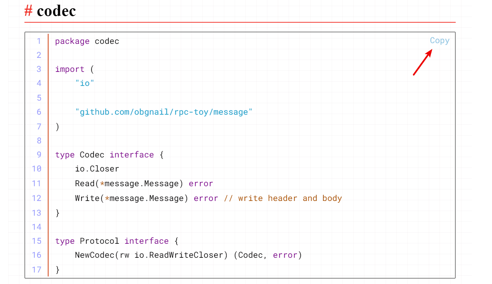

# Typora Plugin

<div align="center">
  
</div>

目前支持的功能：

| 序号 | 文件名                       | 功能                             | 默认开启   |
| ---- | ---------------------------- | -------------------------------- | ---------- |
| 1    | search_multi                 | 全局多关键字搜索                 | 是         |
| 2    | md_padding                   | 中文与英文、数字之间添加空格     | 是         |
| 3    | commander                    | 命令行环境                       | 是         |
| 4    | read_only                    | 只读模式                         | 是         |
| 5    | collapse_paragraph           | 章节折叠                         | 是         |
| 6    | copy_code                    | 一键复制代码                     | 是         |
| 7    | resize_table                 | 调整表格行高列宽                 | 是         |
| 8    | resize_image                 | 调整图片显示大小                 | 是         |
| 9    | go_top                       | 一键到文章顶部                   | 是         |
| 10   | truncate_text                | 暂时隐藏内容，提高大文件渲染性能 | 是         |
| 11   | window_tab / window_tab_drag | 标签页管理                       | 高版本关闭 |
| 12   | mermaid_replace              | 替换 mermaid 组件                | 否         |

> 每个功能都对应 plugin 文件夹下的一个同名文件（index.js 除外），**如若不需要某些功能，按需删除文件即可**。

> 每个功能都有对应的配置，且每个配置选项都有注释说明。可以按需修改对应 JS 文件里的 config。


## 如何使用

1. 去到 Typora 安装路径，找到包含 `window.html` 的文件夹 A。（不同版本的 Typora 的文件夹结构可能不同，在我这是 `Typora/resources/app`，推荐使用 everything 找一下）
2. 打开文件夹 A，将源码的 plugin 文件夹粘贴进该文件夹下。
3. 打开文件 `A/window.html`。搜索文件内容 `<script src="./app/window/frame.js" defer="defer"></script>`，并在后面加入 `<script src="./plugin/index.js" defer="defer"></script>`。保存。（不同版本的 Typora 查找的内容可能不同，其实就是查找导入 frame.js 的 script 标签）
4. 重启 Typora。


## 实现原理

### 前端

`window.html` 是 Typora 的初始文件，可以写入一个 `<script>` 标签实现功能。就和 Tampermonkey 脚本一样。


### 后端

1. 因为 Typora 暴露了 `reqnode` 函数（require 的封装），所以可以使用 `reqnode('path')` 导入 Node.js 的 path 库，其他内置库同理。
2. 因为 Typora 使用了不太安全的 `executeJavaScript` 功能，所以可以用此注入 JS 代码，从而劫持后端关键对象，进而实现 electron 的后端功能注入。理论上劫持了 electron 对象，你甚至可以在 Typora 里斗地主。

```javascript
// 控制台输入下面命令:

// 恭喜你成功让第二个窗口打印消息
JSBridge.invoke("executeJavaScript", 2, `console.log("i am logging")`);

// 恭喜你成功让所有窗口打印消息
ClientCommand.execForAll(`console.log("i am logging")`);

// 恭喜你成功获取到本窗口的BrowserWindow对象
global.reqnode('electron').remote.require('electron').BrowserWindow;

// 恭喜你成功获取到所有窗口的BrowserWindow对象
ClientCommand.execForAll(`console.log(global.reqnode('electron').remote.require('electron').BrowserWindow)`);

// 恭喜你成功让窗口1执行语句_myValue=123，然后将变量_myValue传给窗口2
JSBridge.invoke('executeJavaScript', 1, "_myValue=123; JSBridge.invoke('executeJavaScript', 2, `console.log(${_myValue})`)");
```


## 插件/脚本

### search_multi：全局多关键字搜索

比如搜索同时包含 `golang` 和 `install` 和 `生命周期` 三个关键字的文件。

- ctrl+shift+P：打开搜索框
- esc：关闭搜索框
- enter：搜索
- ArrowUp，ArrowDown：方向键上下选中
- click、ctrl+enter：当前窗口打开
- ctrl+click、ctrl+shift+enter：新窗口打开
- drag：拖动输入框可移动搜索框

> ctrl 在 Mac 中对应 command


### window_tab / window_tab_drag：标签页管理


window_tab_drag 和 window_tab 的区别是：是否支持拖拽排序。默认使用 window_tab_drag，禁用 window_tab。

> NOTE：**此脚本默认在高版本中关闭**。经反馈，由于高版本的 Typora 更新了 electron 版本，标签页管理功能已经在高版本中失效。详细说明请看下面【脚本会失效吗】章节。容我再想想办法 :(


### md_padding：盘古之白

中英文混排时，中文与英文之间、中文与数字之间添加空格。

> 有研究显示，打字的时候不喜欢在中文和英文之间加空格的人，感情路都走得很辛苦，有七成的比例会在 34 岁的时候跟自己不爱的人结婚，而其余三成的人最后只能把遗产留给自己的猫。毕竟爱情跟书写都需要适时地留白。 —— pangu.js

[pangu.js](https://github.com/vinta/pangu.js) 是网页特供的，对于 markdown 语法会有误判，md_padding 通过解析语法树进行优化。

快捷键：Ctrl+shift+K


> NOTE：**此脚本会直接修改文件**。虽然支持 Ctrl+Z 还原，还是建议提前备份。


### commander：命令行环境

> 如果你看不懂下面描述，那么你就不需要此脚本。

功能和 total commander 的命令行一样（快捷键也一样），一个快速执行命令的工具，并提供少量交互。

- ctrl+G：弹出执行框
- esc：隐藏执行框
- drag：拖动输入框可移动

支持 shell：

- `cmd/bash`：windows 或 Mac 的默认终端
- `powershell`：微软弃子 :D
- `git bash`：使用此终端前请保证安装了 git bash 并且加入环境变量
- `wsl`：使用此终端前请保证安装了 wsl2，并且加入环境变量

内置环境变量：

- `$f`：当前文件路径
- `$d`：当前文件的所属目录
- `$m`：当前挂载的根目录

支持内建命令，方便快速调用。个人可按需自定义脚本里的 `BUILTIN` 变量。

```js
// 默认的内建命令
const BUILTIN = [
    {name: "", shell: SHELL.CMD_BASH, cmd: ""}, // dummy
    {name: "Explorer", shell: SHELL.POWER_SHELL, cmd: "explorer $d"},
    {name: "Vscode", shell: SHELL.CMD_BASH, cmd: "code $f"},
    {name: "WT", shell: SHELL.CMD_BASH, cmd: "cd $d && wt"},
    {name: "GitCommit", shell: SHELL.CMD_BASH, cmd: `cd $m && git add . && git commit -m "message"`},
];
```


### collapse_paragraph：章节折叠

ctrl+鼠标点击，折叠 / 展开 章节下所有文本。

支持折叠的标签：h1~h6。


### resize_table：拖动调整表格大小

ctrl+鼠标拖动，修改表格的行高列宽。


### resize_image：调整图片大小

ctrl+鼠标滚轮滚动，修改图片大小。


### copy_code：一键复制代码




### read_only：只读模式

只读模式下文档不可编辑。快捷键：ctrl+shift+R。


### truncate_text：暂时隐藏内容，提高大文件渲染性能

大文件在 Typora 的渲染性能很糟糕，用此脚本暂时隐藏内容（只是隐藏显示，不修改文件），提高渲染性能。

- ctrl+shift+B：隐藏最前面的文本段
- ctrl+shift+U：重新显示所有文本段
- ctrl+shift+Y：根据当前可视范围显示文本段

> 原理：通过设置 DOM 元素的 display 样式为 none 来隐藏元素，让元素不占用渲染树中的位置，对隐藏的元素操作不会引发其他元素的重排。


### go_top： 一键到顶

在右下角添加一个一键到顶的按钮。


### mermaid_replace：替换 mermaid

如果你像我一样，不愿意更新 Typora 版本，同时又想使用新版本的 mermaid，或者想自定义 mermaid 样式，可以使用此脚本。

> NOTE：**此脚本默认关闭，需手动开启。**


## 瞎聊

### 为什么要区分 window_tab 和 window_tab_drag ?

理由是：**支持排序会复杂很多**。

Typora 每开一个窗口，就会创建一个 electron BrowserWindow 实例，而且每个实例都有自己的 web 页面和渲染进程。标签管理本来是应该在 electron 后端实现的，现在强行要在前端实现，只能使用劫持后端关键对象，然后在每个窗口绘制这种非常绿皮的方式实现。

排序意味着状态的引入 —— 当创建第五个窗口的时候，新建的窗口必须要知道前面四个窗口的顺序：

- 如果此功能在后端实现的话就很好办，搞一个全局对象保存现有的窗口列表，创建窗口的时候传给他。
- 如果在前端实现的话就很痛苦，如上所述，每个窗口都有自己的 web 页面和渲染进程，你无法跨进程获取变量。

最可行的方案是使用 localStorage 存储当前的窗口列表。但是我希望脚本是无状态的，每次打开都是一次全新开始 —— 如果 Typora 崩溃，处在 localStroge 里的脏数据就会影响下次启动。

我采取的方法是应答。第五个窗口创建的时候就会通过 IPC 去询问第四个窗口当前的窗口列表，等第四个窗口回复之后，第五个窗口进行数据处理，再将新的窗口列表通知给所有的窗口，让它们重新渲染。

**这种方式就是带着脚铐跳舞，是奇技淫巧，绿皮中的绿皮**。


### 脚本会失效吗

Typora 是闭源软件，要是有一天作者改了代码，是不是就不能用了？从原理来说，是的。实际上我是解包 Typora，看了部分源码才实现了这些功能。

同时值得注意的是， Typora 的历史包袱还蛮重的。比如说 github 已经有无数个 Typora theme，这决定了它的页面它不可能大改，就算改变也大概率是向下兼容的。

具体来看：

- search_multi、resize_table、read_only、truncate_text 等功能几乎不依赖 Typora 实现。如果这些功能失效了，那么 github 上的 Typora theme 会大面积失效，所以应该会 **保持长时间的有效性**。而且就算失效了也容易找到兼容方案。
- 比较特殊的是 window_tab 和 window_tab_drag，这个功能本质是入侵式脚本；通过原型链攻击，将后端 electron 对象劫持到前端来，该脚本通过该手段成功调用了 Typora 的核心实现，并且这个核心实现同时被大量运用，历史包袱一样很大。当然了，劫持漏洞也有可能被修复。**如果 Typora 或 electron 有了重构级别的更新，那么大概率会失效**。

> 总结：标签页管理功能比较危险，其他脚本保持长时间的有效性。如果脚本失效了，麻烦提个 issue。


## 小众软件推荐

[通过注入 js 代码，为 Typora 额外增加 4 个功能](https://www.appinn.com/typora-4-plugin/)

> 第一次上榜小众软件，心情非常冲动。同时祝小众软件越办越好。


## 结语

本人并非前端开发，JS/CSS 写的很烂。感谢 new bing 对于本项目的大力支持。感谢 [md-padding](https://github.com/harttle/md-padding) 提供的 space padding 功能 :) 

如果对各位有用的话，欢迎 star ⭐

