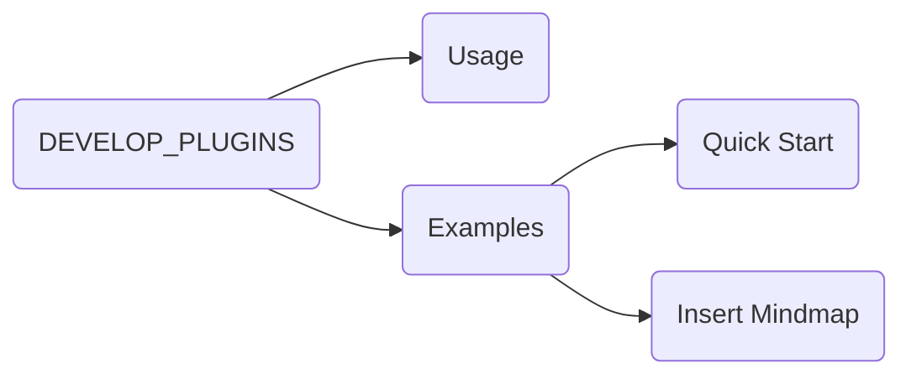
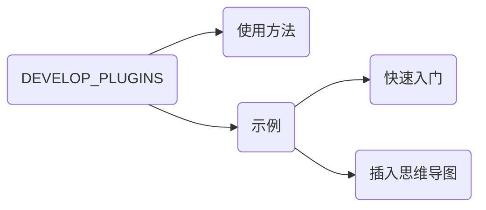

# English Version

## Usage

Customizing a plugin requires only two steps:

1. **Add Plugin Configuration**: Add your plugin's configuration in the `./plugin/global/settings/settings.user.toml` file.
2. **Write Plugin Code**: Create a `.js` file with the same name as your plugin in the `./plugin/` directory. Write a class that extends `BasePlugin` and export it as `plugin`.


## Examples

### Quick Start

This example demonstrates how to create a simple plugin that displays an alert box when triggered by a hotkey and outputs information to the console.

Step 1: Add the following configuration in `./plugin/global/settings/settings.user.toml`:

```toml
[helloWorld]
NAME = "Hello World"  # Plugin name
ENABLE = true  # Whether the plugin is enabled
HOTKEY = "ctrl+alt+u"  # Hotkey to trigger the plugin

console_message = "I am in process"  # Define the message to output in the console
show_message = "this is hello world plugin"  # Define the message to display in the alert box
```

> `NAME` and `ENABLE` are required fields; the rest are custom configurations for the plugin.

Step 2: Create the `./plugin/helloWorld.js` file and save the following code in it:

```javascript
// ./plugin/helloWorld.js

class helloWorld extends BasePlugin {
  // Executed first, used to check prerequisites for running the plugin
  // If conditions are not met, return this.utils.PLUGIN_LOAD_ABORT to abort plugin loading
  prepare = async () => {
    // Please replace with meaningful condition checks in actual development
    if (false) {
      return this.utils.PLUGIN_LOAD_ABORT
    }
  }

  // Register CSS styles. Returns a string that will be automatically inserted into the DOM as a <style> tag
  style = () => "#hello-world { margin: 10px; }"

  // Register DOM elements. Can return an Element type or a string representing the element, which will be automatically inserted into the DOM
  html = () => "<div id='hello-world'></div>"

  // Register trigger hotkeys. Returns an array
  hotkey = () => [{ hotkey: this.config.HOTKEY, callback: this.call }]

  // Used for plugin initialization. Typically used to get/set DOM elements, initialize variables, etc.
  init = () => {
    // Get the DOM element inserted by the html() method
    this.myDiv = document.querySelector("#hello-world")
  }

  // The process method runs automatically after plugin initialization (after executing the registration logic above)
  process = () => {
    // All configuration items in the TOML file can be accessed via this.config
    console.log("[helloWorld]", this.config.console_message)
    console.log("[helloWorld]", this)
    console.log("[helloWorld]", this.myDiv)
  }

  // The call method is automatically invoked when clicking a context menu option or typing the hotkey
  call = (action, meta) => {
    alert(this.config.show_message)
  }
}

// Export the plugin class
module.exports = { plugin: helloWorld }
```

Verification:

1. Restart Typora.
2. Open Chrome devtools and check if the console outputs `I am in process`, the plugin object, and the corresponding Element.
3. Press your defined hotkey `ctrl+alt+u`, and an alert box should pop up.


### Insert Mindmap

This example demonstrates how to get the outline structure of the current document, convert it into a Mermaid graph, and insert it into the document.

Implementation:

1. Step 1: Add the configuration in `./plugin/global/settings/settings.user.toml`.
2. Step 2: Under the `./plugin` directory, create a js file with the same name as the plugin (`insertMindmap.js`). Create a class that extends `BasePlugin` in this file and export it as `plugin`.

```toml
# ./plugin/global/settings/settings.user.toml

[insertMindmap]
NAME = "Insert Mindmap"  # Plugin name
ENABLE = true  # Whether the plugin is enabled
HOTKEY = "ctrl+alt+u"  # Hotkey to trigger the plugin
```

```javascript
// ./plugin/insertMindmap.js

class insertMindmap extends BasePlugin {
  // Register trigger hotkeys. Returns an array
  hotkey = () => [{ hotkey: this.config.HOTKEY, callback: this.call }]

  // The call method gets the document outline tree, converts it to Mermaid format, and inserts it into the document
  call = (action, meta) => {
    const tree = this.utils.getTocTree() // Get the document outline tree structure
    const mermaid = this._toGraph(tree)  // Convert the tree structure into Mermaid graph format
    this.utils.insertText(null, mermaid) // Insert the generated Mermaid code into the document
  }

  _toGraph = tree => {
    let num = 0
    const getName = node => {
      if (node._shortName) {
        return node._shortName
      }
      node._shortName = "T" + ++num
      const name = node.text.replace(/"/g, "#quot;")
      return `${node._shortName}("${name}")`
    }
    const getTokens = (node, list) => {
      node.children.forEach(child => list.push(getName(node), "-->", getName(child), "\n"))
      node.children.forEach(child => getTokens(child, list))
      return list
    }
    const tokens = getTokens(tree, ["graph LR", "\n"])
    return ["```mermaid", "\n ", ...tokens, "```"].join("")
  }
}

// Export the plugin class
module.exports = { plugin: insertMindmap }
```

Verification:

Open Typora and press your defined hotkey `ctrl+alt+u`. Based on the outline structure of the current document, a corresponding Mermaid graph will be inserted into the document.

For example, for a `README.md` document with the following structure:

```markdown
## Usage
## Examples
### Quick Start
### Insert Mindmap
```

The generated Mermaid graph will look like this:




# 简体中文版

## 使用方法

自定义插件仅需两步：

1. **添加插件配置**：在 `./plugin/global/settings/settings.user.toml` 文件中添加插件配置。
2. **编写插件代码**：在 `./plugin/` 目录下创建与插件同名的 `.js` 文件，编写继承 `BasePlugin` 的类并导出为 `plugin`。


## 示例

### 快速入门

此示例展示了如何创建一个简单的插件，实现快捷键触发时显示提示框，并在控制台输出信息。

步骤一：在 `./plugin/global/settings/settings.user.toml` 添加以下配置：

```toml
[helloWorld]
NAME = "你好世界"  # 插件名称
ENABLE =  true  # 插件是否启用
HOTKEY = "ctrl+alt+u"  # 触发插件的快捷键

console_message = "I am in process"  # 定义将在控制台输出的信息
show_message = "this is hello world plugin"  # 定义将在提示框中显示的信息
```

> NAME、ENABLE 是必须项，其余是插件个性化的配置。

步骤二：创建文件 `./plugin/helloWorld.js` 文件，并将以下代码保存到该文件中：

```javascript
// ./plugin/helloWorld.js

class helloWorld extends BasePlugin {
  // 最先执行，用于检查插件运行的前提条件
  // 如果条件不满足，返回 this.utils.PLUGIN_LOAD_ABORT 以终止插件加载
  prepare = async () => {
    // 实际开发中请替换为有意义的条件检查
    if (false) {
      return this.utils.PLUGIN_LOAD_ABORT
    }
  }

  // 注册 CSS 样式。返回一个字符串，该字符串会自动作为 <style> 标签插入到 DOM 中
  style = () => "#hello-world { margin: 10px; }"

  // 注册 DOM 元素。可以返回 Element 类型或表示元素的字符串，它们将自动插入到 DOM 中
  html = () => "<div id='hello-world'></div>"

  // 注册触发快捷键，返回一个数组
  hotkey = () => [{ hotkey: this.config.HOTKEY, callback: this.call }]

  // 用于插件的初始化，通常在这里获取或设置 DOM 元素、初始化变量等
  init = () => {
    // 获取 html() 方法插入的 DOM 元素
    this.myDiv = document.querySelector("#hello-world")
  }

  // process 方法在插件初始化完成后（执行上述注册逻辑后）自动运行
  process = () => {
    // 可以通过 this.config 获取 TOML 文件中的所有配置项
    console.log("[helloWorld]", this.config.console_message)
    console.log("[helloWorld]", this)
    console.log("[helloWorld]", this.myDiv)
  }

  // call 方法在点击右键菜单选项或键入快捷键时自动调用
  call = (action, meta) => {
    alert(this.config.show_message)
  }
}

// 导出插件类
module.exports = { plugin: helloWorld }
```

验证：

1. 重启 Typora。
2. 打开 Chrome devtools，检查控制台是否输出了 `I am in process`、插件对象和对应的 Element。
4. 按下您定义的快捷键 `ctrl+alt+u`，弹出提示框。


### 插入思维导图

此示例演示如何获取当前文档的大纲结构，并将其转换为 Mermaid 图的形式插入到文档中。

实现：

1. 步骤一：在 `./plugin/global/settings/settings.user.toml` 添加配置。
2. 步骤二：在 `./plugin` 目录下，创建和插件同名的 js 文件（`insertMindmap.js`），在此文件中创建一个 class 继承自 BasePlugin，并导出为 `plugin`。

```toml
# ./plugin/global/settings/settings.user.toml

[insertMindmap]
NAME = "插入思维导图"  # 插件名称
ENABLE =  true  # 插件是否启用
HOTKEY = "ctrl+alt+u"  # 触发插件的快捷键
```

```javascript
// ./plugin/insertMindmap.js

class insertMindmap extends BasePlugin {
  // 注册触发快捷键，返回一个数组
  hotkey = () => [{ hotkey: this.config.HOTKEY, callback: this.call }]

  // call 方法获取文档大纲树，转换为 Mermaid 格式，并插入到文档中
  call = (action, meta) => {
    const tree = this.utils.getTocTree() // 获取文档大纲树结构
    const mermaid = this._toGraph(tree)  // 将树结构转换为 Mermaid 图格式
    this.utils.insertText(null, mermaid) // 将生成的 Mermaid 代码插入到文档中
  }

  _toGraph = tree => {
    let num = 0
    const getName = node => {
      if (node._shortName) {
        return node._shortName
      }
      node._shortName = "T" + ++num
      const name = node.text.replace(/"/g, "#quot;")
      return `${node._shortName}("${name}")`
    }
    const getTokens = (node, list) => {
      node.children.forEach(child => list.push(getName(node), "-->", getName(child), "\n"))
      node.children.forEach(child => getTokens(child, list))
      return list
    }
    const tokens = getTokens(tree, ["graph LR", "\n"])
    return ["```mermaid", "\n ", ...tokens, "```"].join("")
  }
}

// 导出插件类
module.exports = { plugin: insertMindmap }
```

验证：

打开 Typora，按下您定义的快捷键 `ctrl+alt+u`。根据当前文档的大纲结构，一个对应的 Mermaid 图将插入到文档中。

例如，对于具有以下结构的文档 `README.md`：

```markdown
## 使用方法
## 示例
### 快速入门
### 插入思维导图
```

生成的 Mermaid 图如下所示：


