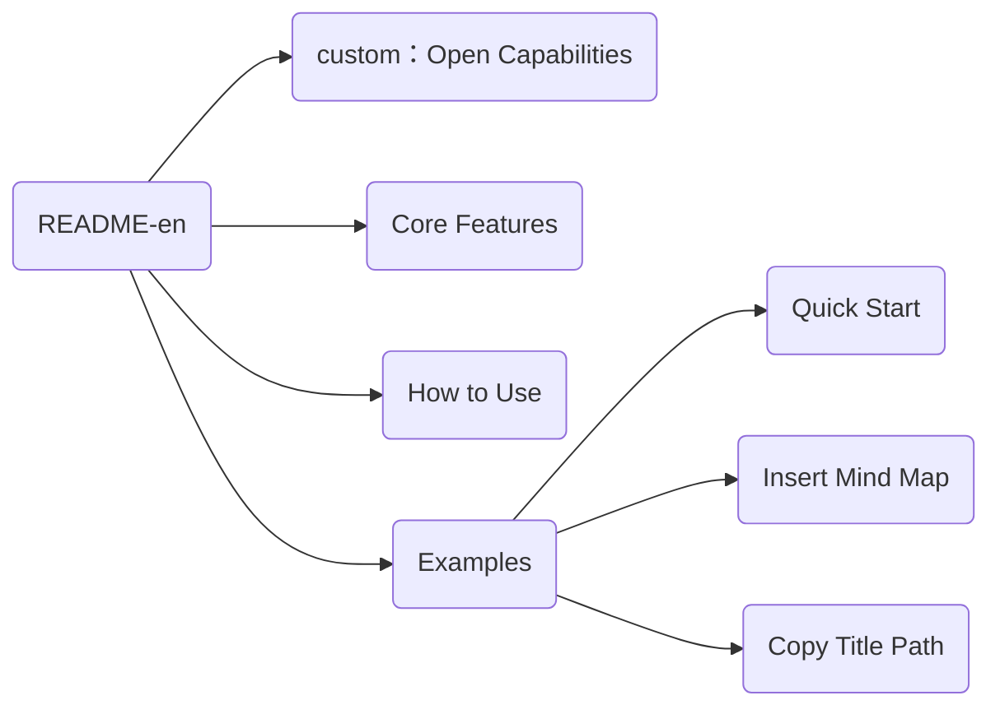

## custom：Open Capabilities

The `custom` plugin offers open capabilities, allowing you to **create and integrate custom functionalities** within the right-click menu.


## Core Features

The custom plugin enables customization through **declarative configuration and code**:

- **Register UI elements and behaviors:** Supports defining CSS styles (`style`), HTML elements (`html`), right-click menu hints (`hint`), and keyboard shortcuts (`hotkey`).
- **Flexible Lifecycle:** Provides lifecycle functions such as `beforeProcess`, `init`, `process`, `afterProcess`, and `callback`, allowing you to execute custom logic at different stages of the plugin.
- **Cursor Position Control:** Use `selector` to define the cursor positions where the plugin is available.


## How to Use

Customizing a plugin involves just two steps:

1. **Add Plugin Configuration:** Add the plugin configuration to the `./plugin/global/settings/custom_plugin.user.toml` file.
2. **Write Plugin Code:** Create a `.js` file with the same name as the plugin in the `./plugin/custom/plugins` directory, write a class that inherits from `BaseCustomPlugin`, and export it as `plugin`.


## Examples

### Quick Start

This example demonstrates how to create a simple plugin that displays a pop-up message and outputs information to the console when triggered by a right-click menu selection or a keyboard shortcut.

Step 1: Add the following configuration to `./plugin/global/settings/custom_plugin.user.toml`:

```toml
[helloWorld]
name = "hellworld"   # Display name of the plugin in the right-click menu
enable = true     # Controls whether the plugin is enabled
hide = false      # Controls whether the plugin is hidden in the right-click menu
order = 1         # Display order of the plugin in the right-click menu (larger value means later, supports negative numbers)

hotkey = "ctrl+alt+u" # Defines the shortcut to trigger the plugin
console_message = "I am in process" # Defines the message to be output to the console
show_message = "this is hello world plugin" # Defines the message to be displayed in the pop-up
```

> `name`, `enable`, `hide`, and `order` are mandatory. The rest are personalized configurations for the plugin.

Step 2: Create the file `./plugin/custom/plugins/helloWorld.js` and save the following code in it:

```javascript
// ./plugin/custom/plugins/helloWorld.js

class helloWorld extends BaseCustomPlugin {
    // beforeProcess method is executed first to check preconditions for plugin execution
    // If conditions are not met, it should return this.utils.stopLoadPluginError to stop plugin loading
    beforeProcess = async () => {
        // In actual development, please replace the 'false' here with meaningful condition check logic
        if (false) {
            return this.utils.stopLoadPluginError
        }
    }

    // Registers CSS styles. Returns a string that will be automatically inserted into the DOM as a <style> tag
    style = () => "#hello-world { margin: 10px; }"

    // Registers DOM elements. Can return an Element type or a string representing the element, which will be automatically inserted into the DOM
    html = () => "<div id='hello-world'></div>"

    // Registers the hint message for the right-click menu
    hint = () => "this is hello world hint"

    // Registers the shortcut key to trigger the callback. Returns an array of strings
    hotkey = () => [this.config.hotkey]

    // Used for plugin initialization, typically for getting or setting DOM elements, initializing variables, etc.
    init = () => {
        // Get the DOM element inserted by the html() method
        this.myDiv = document.querySelector("#hello-world")
    }

    // process method runs automatically after plugin initialization is complete (after executing the above registration logic)
    process = () => {
		// All configuration items from the TOML file can be accessed via this.config
        console.log(this.config.console_message)
        console.log("[helloWorldPlugin]: ", this)
        console.log(this.myDiv)
    }

    // callback method is automatically called when clicking a right-click menu option or typing a shortcut key
    // Note: If the callback function is not defined, the plugin cannot be triggered by clicking the right-click menu
    // The anchorNode parameter represents the Element where the cursor is located when the plugin is called
    callback = anchorNode => {
        alert(this.config.show_message)
    }
}

// Export the plugin class
module.exports = { plugin: helloWorld }
```

Verification:

1. Restart Typora.
2. Open Chrome devtools and check if "I am in process", the plugin object, and the corresponding Element are output to the console.
3. Right-click the editor area to open the right-click menu. Hover the mouse over `常用插件 -> 二级插件 -> 你好世界`. The hint message "this is hello world hint" should be displayed. Click the `你好世界` menu item. A pop-up box should appear, displaying "this is hello world plugin".
4. Press the shortcut key `ctrl+alt+u` you defined. The same pop-up box should appear.


### Insert Mind Map

This example demonstrates how to get the outline structure of the current document and insert it into the document in the form of a Mermaid diagram.

Implementation:

1. Step 1: Add the configuration in `./plugin/global/settings/custom_plugin.user.toml`.
2. Step 2: In the `./plugin/custom/plugins` directory, create a `.js` file with the same name as the plugin (`insertMindmap.js`). In this file, create a class that inherits from BaseCustomPlugin and export it as `plugin`.

```toml
# ./plugin/global/settings/custom_plugin.user.toml

[insertMindmap]
name = "InsertMindMap" # Plugin name
enable = true          # Whether to enable this secondary plugin
hide = false           # Whether to hide it in the right-click menu
order = 1              # Order of appearance in the right-click menu
```

```javascript
// ./plugin/custom/plugins/insertMindmap.js

class insertMindmap extends BaseCustomPlugin {
    // The callback method gets the document outline tree, converts it to Mermaid format, and inserts it into the document
    callback = anchorNode => {
        const tree = this.utils.getTocTree() // Get the document outline tree structure
        const mermaid = this._toGraph(tree)  // Convert the tree structure to Mermaid graph format
        this.utils.insertText(null, mermaid) // Insert the generated Mermaid code into the document
    }

    _toGraph = tree => {
        let num = 0
        const getName = node => {
            if (node._shortName) {
                return node._shortName
            }
            node._shortName = "T" + ++num
            const name = node.text.replace(/"/g, "")
            return `${node._shortName}("${name}")`
        }
        const getTokens = (node, list) => {
            node.children.forEach(child => list.push(getName(node), "-->", getName(child), "\n"))
            node.children.forEach(child => getTokens(child, list))
            return list
        }
        const tokens = getTokens(tree, ["graph LR", "\n"])
        return ["``` mermaid ", "\n ", ...tokens, "```"].join("")
    }
}

// Export the plugin class
module.exports = { plugin: insertMindmap }
```

Verification:

Open Typora and right-click the editor area to open the right-click menu. Select `常用插件 -> 二级插件 -> 插入思维导图` and click. Based on the outline structure of the current document, a corresponding Mermaid diagram will be inserted into the document.

For example, for a document `README-en.md` with the following structure:

```markdown
## custom：Open Capabilities
## Core Features
## How to Use
## Examples
### Quick Start
### Insert Mind Map
### Copy Title Path
```

The generated Mermaid diagram will look like this:



### Copy Title Path

This example demonstrates how to add an option to the right-click menu that copies the full path of the current title to the clipboard when the cursor is on a title.

Requirements:

1. The plugin is only available when the cursor is on a title element (`[mdtype = "heading"]`).
2. Triggered by the shortcut key `ctrl+shift+u`.

Implementation:

1. Step 1: Add the configuration in `./plugin/global/settings/custom_plugin.user.toml`.
2. Step 2: In the `./plugin/custom/plugins` directory, create a `.js` file with the same name as the plugin (`myFullPathCopy.js`). In this file, create a class that inherits from BaseCustomPlugin and export it as `plugin`.
3. Step 3: Verify. Place the cursor on a title, right-click the plugin option or use the shortcut key, and then try pasting to verify that the title path has been copied.

``` toml
# ./plugin/global/settings/custom_plugin.user.toml

[myFullPathCopy]
name = "CopyFullPath" # Plugin name
enable = true         # Whether to enable this secondary plugin
hide = false          # Whether to hide it in the right-click menu
order = 1             # Order of appearance in the right-click menu

# Shortcut key
hotkey = "ctrl+shift+u"
# File name used if this plugin is called on a blank page (file does not exist yet, requires a default name)
untitled_file_name = "untitled"
# Whether to skip empty titles
ignore_empty_header = false
# Whether to add a space between the title and the hint
add_space = true
```

``` javascript
// ./plugin/custom/plugins/myFullPathCopy.js

// 1
class myFullPathCopy extends BaseCustomPlugin {
    // 2
    selector = () => '#write [mdtype = "heading"]'
    // 3
    hint = () => "Copy the path of the current title to the clipboard"
    // 4
    init = () => {}
    // 5
    style = () => {}
    // 6
    styleTemplate = () => {}
    // 7
    html = () => {}
    // 8
    hotkey = () => [this.config.hotkey]
    // 9
    beforeProcess = async () => {}
    // 10
    process = () => {}
    // 11
    callback = anchorNode => {
        const text = this.getFullPath()
        navigator.clipboard.writeText(text)
    }

    getFullPath = () => {
        const headers = []
        const paragraphs = ["H1", "H2", "H3", "H4", "H5", "H6"]
        const nameList = ["Level 1 Title", "Level 2 Title", "Level 3 Title", "Level 4 Title", "Level 5 Title", "Level 6 Title"]

        let ele = anchorNode
        while (ele) {
            const idx = paragraphs.indexOf(ele.tagName)
            if (idx ! == -1 && (headers.length == = 0 || (headers [headers.length - 1].idx > idx))) {
                headers.push({ ele, idx })
                if (idx === 0) {
                    break
                }
            }
            ele = ele.previousElementSibling
        }

        headers.reverse()

        const filePath = this.utils.getFilePath() || this.config.untitled_file_name
        const result = [filePath]

        let idx = 0
        for (const h of headers) {
            while (idx < 6 && h.ele.tagName !== paragraphs [idx]) {
                if (! this.config.ignore_empty_header) {
                    const name = this.getHeaderName("Untitled", nameList [idx])
                    result.push(name)
                }
                idx++
            }

            if (h.ele.tagName === paragraphs [idx]) {
                const name = this.getHeaderName(h.ele.textContent, nameList [idx])
                result.push(name)
                idx++
            }
        }

        const text = this.utils.Package.Path.join(...result)
        return text
    }

    getHeaderName = (title, name) => {
        const space = this.config.add_space ? " " : ""
        return title + space + name
    }
}

// 12
module.exports = { plugin: myFullPathCopy }

// 1. Create a class that inherits from the BaseCustomPlugin class. This will automatically give myFullPathCopy the utils and config properties.
//    - config: All configuration fields for this plugin in the custom_plugin.user.toml file.
//    - utils: Static utility class provided by the plugin system, defined in `./plugin/global/core/utils`.
// 2. selector: Defines the cursor positions where the plugin is available. The plugin is only available when the cursor is on which elements. Returning a null-like value means it is available at any position. Here, it means it is only available when the cursor is on a Markdown heading element.
// 3. hint: The hint message displayed when the mouse hovers over the right-click menu option.
// 4. init: Perform variable initialization operations here.
// 5. style: Used to insert style tags. The return value is a string.
// 6. styleTemplate: Introduces the css file with the same name as the plugin in the `./plugin/global/user_styles` directory. For details, please refer to `./plugin/global/user_styles/README.md`.
// 7. html: Used to insert HTML tags. Returns an Element type or a string representing the element.
// 8. hotkey: Registers a shortcut key for the callback function. Returns an array of strings, or an array of objects in the format [{ hotkey: "", callback: () => console.log(123) }].
// 9. beforeProcess: The first function to be executed, used to initialize data required by the plugin or perform pre-checks. If it returns utils.stopLoadPluginError, plugin loading is stopped.
// 10. process: Add plugin business logic here.
// 11. callback: The callback function called when the user clicks a right-click menu option or types a shortcut key. The anchorNode parameter represents the Element where the cursor is located.
// 12. export: Export the plugin class as `plugin`.
```

​	

