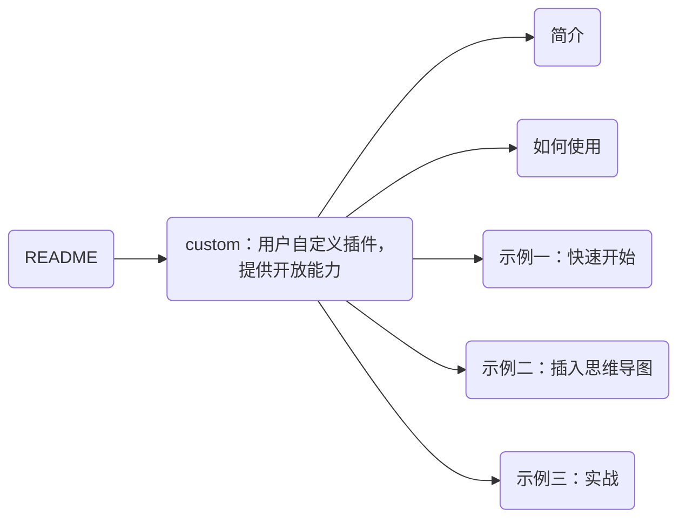

## custom：用户自定义插件，提供开放能力

custom 插件的功能：支持用户 **在右键菜单中自定义插件**。


### 简介

custom 插件大量采用 **声明式代码**（声明代替代码开发）：

- `style = () => "..."`：注册 CSS
- `html = () => "..."`：注册 HTML 元素
- `hint = () => "..."`：注册 hint
- `selector = () => "..."`：注册允许运行命令的光标位置
- `hotkey = () => ["ctrl+shift+y"]`：注册快捷键
- `beforeProcess`、`init`、`process`、`afterProcess`、`callback` 等生命周期函数

```js
class MyPlugin extends BaseCustomPlugin {
    style = () => "#copy-full-path-plugin { margin: 10px; }"

    html = () => "<div id='copy-full-path-plugin'></div>"

    hint = () => "当用户鼠标悬停于右键菜单选项时，会显示这里的内容"

    hotkey = () => ["ctrl+shift+y"]

    init = () => this._arg = "this is plugin custom arg"

    process = () => {
        const element = document.querySelector("#copy-full-path-plugin")
        console.log(element, this._arg)
        console.log("所有插件自动拥有utils对象，utils拥有大量辅助函数", this.utils)
    }

    callback = anchorNode => {
        console.log("当用户键入快捷键ctrl+shift+y，或者点击右键菜单选项，就会调用callback函数")
    }
}

module.exports = { plugin: MyPlugin }
```


### 如何使用

仅需两步：

1. 在 `./plugin/global/settings/custom_plugin.user.toml` 添加配置。
2. 在 `./plugin/custom/plugins` 目录下，创建一个和插件同名的 js 文件，在此文件中创建一个 class 继承自 BaseCustomPlugin，并导出为 `plugin`。


### 示例一：快速开始

> 您可以根据下面的步骤，先把插件跑起来。

步骤一：在 `./plugin/global/settings/custom_plugin.user.toml` 添加如下配置：

```toml
[helloWorld]
name = "你好世界"   # 插件名称
enable = true     # 是否启用此二级插件
hide = false      # 是否在右键菜单中隐藏
order = 1         # 在右键菜单中的出现顺序（越大越排到后面，允许负数）

hotkey = "ctrl+alt+u"
console_message = "I am in process"
show_message = "this is hello world plugin"
```

> name、enable、hide、order 是必须项，其余是插件个性化的配置。


步骤二：创建文件 `./plugin/custom/plugins/helloWorld.js` 文件，将下面代码保存到该文件中：

```javascript
// ./plugin/custom/plugins/helloWorld.js

class helloWorld extends BaseCustomPlugin {
    // beforeProcess是最先运行的方法，请在这里检查插件的运行条件
    // 若不满足条件，请返回this.utils.stopLoadPluginError，插件将终止运行
    beforeProcess = async () => {
        // 这里使用false抑制，实际开发时请改成有意义的检查
        if (false) {
            return this.utils.stopLoadPluginError
        }
    }

    // 注册样式。返回string，会自动作为<style>插入DOM中
    style = () => "#hello-world { margin: 10px; }"

    // 注册DOM。返回Element类型或者element-string，会自动插入到DOM中
    html = () => "<div id='hello-world'></div>"

    // 注册hint
    hint = () => "this is hello world hint"

    // 注册快捷键
    hotkey = () => [this.config.hotkey]

    // 注册变量
    init = () => {
        this.myDiv = document.querySelector("#hello-world")  // 获取html()插入的DOM元素
    }

    // process方法会在插件初始化后（执行上述注册逻辑后）自动运行
    process = () => {
        console.log(this.config.console_message)  // toml文件里的所有配置项都可以通过this.config获取
        console.log("[helloWorldPlugin]: ", this)
        console.log(this.myDiv)
    }

    // 点击右键菜单选项时、键入快捷键时会自动调用callback方法（注意：若没有callback函数，则此插件在右键菜单中将不可点击）
    // anchorNode: 调用此插件时，光标所在的Element
    callback = anchorNode => {
        alert(this.config.show_message)
    }
}

module.exports = { plugin: helloWorld }
```

验证：

1. 重启 Typora。
2. 打开 Chrome devtools，发现控制台输出了 `I am in process` 、插件对象 和 Element。
3. 右键鼠标弹出菜单，鼠标悬停在 `常用插件 -> 二级插件 -> 你好世界`。发现出现了 hint，显示 `this is hello world hint`。点击 `你好世界`，发现弹出了提示框，显示 `this is hello world plugin`。
4. 键入快捷键 `ctrl+alt+u`，发现弹出了同样的提示框。


### 示例二：插入思维导图

需求：在右键菜单中添加一个 `插入思维导图` 选项，功能为：获取文件大纲，使用 graph 类型的 mermaid 图形作为思维导图插入到文档中。

实现：

1. 步骤一：在 `./plugin/global/settings/custom_plugin.user.toml` 添加配置。
2. 步骤二：在 `./plugin/custom/plugins` 目录下，创建和插件同名的 js 文件（`insertMindmap.js`），在此文件中创建一个 class 继承自 BaseCustomPlugin，并导出为 `plugin`。

```toml
# ./plugin/global/settings/custom_plugin.user.toml

[insertMindmap]
name = "插入思维导图"  # 插件名称
enable = true        # 是否启用此二级插件
hide = false         # 是否在右键菜单中隐藏
order = 1            # 在右键菜单中的出现顺序（越大越排到后面，允许负数）
```

```javascript
// ./plugin/custom/plugins/insertMindmap.js

class insertMindmap extends BaseCustomPlugin {
    callback = anchorNode => {
        const tree = this.utils.getTocTree()
        const mermaid = this._toGraph(tree)
        this.utils.insertText(null, mermaid)
    }

    _toGraph = tree => {
        let num = 0
        const getName = node => {
            if (node._shortName) {
                return node._shortName
            }
            node._shortName = "T" + ++num
            const name = node.text.replace(/"/g, "")
            return `${node._shortName}("${name}")`
        }
        const getTokens = (node, list) => {
            node.children.forEach(child => list.push(getName(node), "-->", getName(child), "\n"))
            node.children.forEach(child => getTokens(child, list))
            return list
        }
        const tokens = getTokens(tree, ["graph LR", "\n"])
        return ["```mermaid", "\n", ...tokens, "```"].join("")
    }
}

module.exports = { plugin: insertMindmap }
```

验证：

打开 Typora，右键弹出菜单，`常用插件 -> 二级插件 -> 插入思维导图`，点击。

比如当前文件生成的图形如下所示：




### 示例三：实战

需求如下：

1. 在右键菜单中添加一个 `获取标题路径` （类似于 `messing.md\无 一级标题\开放平台 二级标题\window_tab 三级标题`），然后将其写入剪切板。
2. 当光标位于【正文标题】中才可使用。
3. 快捷键 `ctrl+shift+u`。

实现：

1. 步骤一：在 `./plugin/global/settings/custom_plugin.user.toml` 添加配置。
2. 步骤二：在 `./plugin/custom/plugins` 目录下，创建和插件同名的 js 文件（`myFullPathCopy.js`），在此文件中创建一个 class 继承自 BaseCustomPlugin，并导出为 `plugin`。

```toml
# ./plugin/global/settings/custom_plugin.user.toml

[myFullPathCopy]
name = "复制标题路径"  # 插件名称
enable = true        # 是否启用此二级插件
hide = false         # 是否在右键菜单中隐藏
order = 1            # 在右键菜单中的出现顺序（越大越排到后面，允许负数）

# 快捷键
hotkey = "ctrl+shift+u"
# 如果在空白页调用此插件，使用的文件名（文件还不存在，需要用一个默认的文件名代替）
untitled_file_name = "untitled"
# 跳过空白的标题
ignore_empty_header = false
# 标题和提示之前添加空格
add_space = true
```

```javascript
// ./plugin/custom/plugins/myFullPathCopy.js

// 1
class myFullPathCopy extends BaseCustomPlugin {
    // 2
    selector = () => '#write [mdtype="heading"]'
    // 3
    hint = () => "将当前标题的路径复制到剪切板"
    // 4
    init = () => {}
    // 5
    style = () => {}
    // 6
    styleTemplate = () => {}
    // 7
    html = () => {}
    // 8
    hotkey = () => [this.config.hotkey]
    // 9
    beforeProcess = async () => {}
    // 10
    process = () => {}
    // 11
    callback = anchorNode => {
        const text = this.getFullPath()
        navigator.clipboard.writeText(text)
    }

    getFullPath = () => {
        const headers = []
        const paragraphs = ["H1", "H2", "H3", "H4", "H5", "H6"]
        const nameList = ["一级标题", "二级标题", "三级标题", "四级标题", "五级标题", "六级标题"]

        let ele = anchorNode
        while (ele) {
            const idx = paragraphs.indexOf(ele.tagName)
            if (idx !== -1 && (headers.length === 0 || (headers[headers.length - 1].idx > idx))) {
                headers.push({ ele, idx })
                if (idx === 0) {
                    break
                }
            }
            ele = ele.previousElementSibling
        }

        headers.reverse()

        const filePath = this.utils.getFilePath() || this.config.untitled_file_name
        const result = [filePath]
        
        let idx = 0
        for (const h of headers) {
            while (idx < 6 && h.ele.tagName !== paragraphs[idx]) {
                if (!this.config.ignore_empty_header) {
                    const name = this.getHeaderName("无", nameList[idx])
                    result.push(name)
                }
                idx++
            }

            if (h.ele.tagName === paragraphs[idx]) {
                const name = this.getHeaderName(h.ele.textContent, nameList[idx])
                result.push(name)
                idx++
            }
        }

        const text = this.utils.Package.Path.join(...result)
        return text
    }

    getHeaderName = (title, name) => {
        const space = this.config.add_space ? " " : ""
        return title + space + name
    }
}

// 12
module.exports = { plugin: myFullPathCopy }

// 1. 创建 class，继承 BaseCustomPlugin 类。之后 myFullPathCopy 将自动拥有 utils、config 属性
//    - config: 该插件在 custom_plugin.user.toml 里的所有字段
//    - utils: 插件系统自带的静态工具类，其定义在 `./plugin/global/core/utils`
// 2. selector: 允许运行命令的光标位置(当光标位于哪些位置时，此命令才可用)。若返回 null-like value，表示任何位置都可用。在这里的含义就是：只当光标位于【正文标题】时可用
// 3. hint: 当鼠标移动到右键菜单时的提示
// 4. init: 在这里初始化你要的变量
// 5. style: 给 Typora 插入 style 标签。返回值为 string。若你想指定标签的 id，也可以返回 {textID: "", text: ""}。其中 textID 为此 style 标签的 id，text 为 style 内容
// 6. styleTemplate: 引入 `./plugin/global/user_styles` 目录下和插件同名的 css 文件。详情请参考`./plugin/global/user_styles/README.md`
// 7. html: 为 Typora 插入 HTML 标签，返回 Element 类型或者 Element-string
// 8. hotkey: 为 callback 注册快捷键，返回 Array<string> 类型 或者 [{hotkey: "", callback: () => console.log(123)}]
// 9. beforeProcess: 最先执行的函数，在这里初始化插件需要的数据。若返回 utils.stopLoadPluginError，则停止加载插件
// 10. process: 在这里添加添加插件业务逻辑
// 11. callback: 右键菜单中点击/键入快捷键后的回调函数。anchorNode 参数: 鼠标光标所在的 Element
// 12. export: 导出为 plugin
```

验证：

打开 Typora，将光标置于正文标题出，右键弹出菜单，`常用插件 -> 二级插件 -> 复制标题路径`，点击。当前的标题路径就写入剪切板了。在目标文档区域，粘贴，即可把标题路径复制到相应文档区域。

