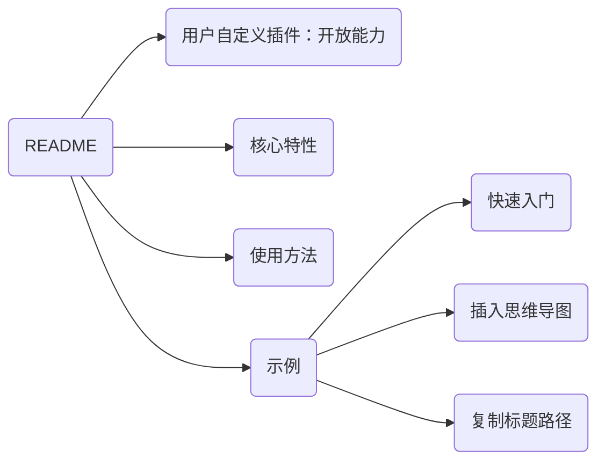

## 用户自定义插件：开放能力

通过 `custom` 插件，为您提供了开放能力，允许您在右键菜单中 **创建和集成自定义功能**。


## 核心特性

custom 插件通过 **声明式配置和代码** 实现自定义：

- **注册界面元素与行为：** 支持定义 CSS 样式 (`style`)、HTML 元素 (`html`)、右键菜单提示 (`hint`)、快捷键 (`hotkey`)。
- **灵活的生命周期：** 提供 `beforeProcess`、`init`、`process`、`afterProcess`、`callback` 等生命周期函数，允许在插件不同阶段执行自定义逻辑。
- **光标位置控制：** 使用 `selector` 定义插件可用的光标位置。


## 使用方法

自定义插件仅需两步：

1. **添加插件配置**：在 `./plugin/global/settings/custom_plugin.user.toml` 文件中添加插件配置。
2. **编写插件代码**：在 `./plugin/custom/plugins` 目录下创建与插件同名的 `.js` 文件，编写继承 `BaseCustomPlugin` 的类并导出为 `plugin`。


## 示例

### 快速入门

此示例展示了如何创建一个简单的插件，实现右键菜单点击或快捷键触发时显示提示框，并在控制台输出信息。

步骤一：在 `./plugin/global/settings/custom_plugin.user.toml` 添加以下配置：

```toml
[helloWorld]
name = "你好世界"   # 插件在右键菜单中显示的名称
enable = true     # 控制插件是否启用
hide = false      # 控制插件是否在右键菜单中隐藏
order = 1         # 插件在右键菜单中的显示顺序（数值越大越靠后，支持负数）

hotkey = "ctrl+alt+u" # 定义触发插件的快捷键
console_message = "I am in process" # 定义将在控制台输出的信息
show_message = "this is hello world plugin" # 定义将在提示框中显示的信息
```

> name、enable、hide、order 是必须项，其余是插件个性化的配置。

步骤二：创建文件 `./plugin/custom/plugins/helloWorld.js` 文件，并将以下代码保存到该文件中：

```javascript
// ./plugin/custom/plugins/helloWorld.js

class helloWorld extends BaseCustomPlugin {
    // beforeProcess 方法最先执行，用于检查插件运行的前提条件
    // 如果条件不满足，应返回 this.utils.stopLoadPluginError 以终止插件加载
    beforeProcess = async () => {
        // 在实际开发中，请替换这里的 false 为有意义的条件检查逻辑
        if (false) {
            return this.utils.stopLoadPluginError
        }
    }

    // 注册 CSS 样式。返回一个字符串，该字符串会自动作为 <style> 标签插入到 DOM 中
    style = () => "#hello-world { margin: 10px; }"

    // 注册 DOM 元素。可以返回 Element 类型或表示元素的字符串，它们将自动插入到 DOM 中
    html = () => "<div id='hello-world'></div>"

    // 注册右键菜单的提示信息
    hint = () => "this is hello world hint"

    // 注册触发 callback 的快捷键。返回一个字符串数组
    hotkey = () => [this.config.hotkey]

    // 用于插件的初始化，通常在这里获取或设置 DOM 元素、初始化变量等
    init = () => {
        // 获取 html() 方法插入的 DOM 元素
        this.myDiv = document.querySelector("#hello-world")
    }

    // process 方法在插件初始化完成后（执行上述注册逻辑后）自动运行
    process = () => {
		// 可以通过 this.config 获取 TOML 文件中的所有配置项
        console.log(this.config.console_message)
        console.log("[helloWorldPlugin]: ", this)
        console.log(this.myDiv)
    }

    // callback 方法在点击右键菜单选项或键入快捷键时自动调用
    // 注意：如果未定义 callback 函数，该插件将无法通过右键菜单点击触发
    // anchorNode 参数表示调用此插件时，光标所在的 Element
    callback = anchorNode => {
        alert(this.config.show_message)
    }
}

// 导出插件类
module.exports = { plugin: helloWorld }
```

验证：

1. 重启 Typora。
2. 打开 Chrome devtools，检查控制台是否输出了 `I am in process`、插件对象和对应的 Element。
3. 右键点击编辑器区域，弹出右键菜单。将鼠标悬停在 `常用插件 -> 二级插件 -> 你好世界` 上，应显示提示信息 `this is hello world hint`。点击 `你好世界` 菜单项，应弹出一个提示框，显示 `this is hello world plugin`。
4. 按下您定义的快捷键 `ctrl+alt+u`，应弹出同样的提示框。


### 插入思维导图

此示例演示如何获取当前文档的大纲结构，并将其转换为 Mermaid 图的形式插入到文档中。

实现：

1. 步骤一：在 `./plugin/global/settings/custom_plugin.user.toml` 添加配置。
2. 步骤二：在 `./plugin/custom/plugins` 目录下，创建和插件同名的 js 文件（`insertMindmap.js`），在此文件中创建一个 class 继承自 BaseCustomPlugin，并导出为 `plugin`。

```toml
# ./plugin/global/settings/custom_plugin.user.toml

[insertMindmap]
name = "插入思维导图"  # 插件名称
enable = true        # 是否启用此二级插件
hide = false         # 是否在右键菜单中隐藏
order = 1            # 在右键菜单中的出现顺序
```

```javascript
// ./plugin/custom/plugins/insertMindmap.js

class insertMindmap extends BaseCustomPlugin {
    // callback 方法获取文档大纲树，转换为 Mermaid 格式，并插入到文档中
    callback = anchorNode => {
        const tree = this.utils.getTocTree() // 获取文档大纲树结构
        const mermaid = this._toGraph(tree)  // 将树结构转换为 Mermaid 图格式
        this.utils.insertText(null, mermaid) // 将生成的 Mermaid 代码插入到文档中
    }

    _toGraph = tree => {
        let num = 0
        const getName = node => {
            if (node._shortName) {
                return node._shortName
            }
            node._shortName = "T" + ++num
            const name = node.text.replace(/"/g, "")
            return `${node._shortName}("${name}")`
        }
        const getTokens = (node, list) => {
            node.children.forEach(child => list.push(getName(node), "-->", getName(child), "\n"))
            node.children.forEach(child => getTokens(child, list))
            return list
        }
        const tokens = getTokens(tree, ["graph LR", "\n"])
        return ["```mermaid", "\n ", ...tokens, "```"].join("")
    }
}

// 导出插件类
module.exports = { plugin: insertMindmap }
```

验证：

打开 Typora，右键点击编辑器区域，弹出右键菜单。选择 `常用插件 -> 二级插件 -> 插入思维导图` 并点击。根据当前文档的大纲结构，一个对应的 Mermaid 图将插入到文档中。

例如，对于具有以下结构的文档 `README.md`：

```markdown
## 用户自定义插件：开放能力
## 核心特性
## 使用方法
## 示例
### 快速入门
### 插入思维导图
### 复制标题路径
```

生成的 Mermaid 图如下所示：




### 复制标题路径

此示例展示了如何在右键菜单中添加选项，当光标位于标题时，将当前标题的完整路径复制到剪切板。

实现：

1. 步骤一：在 `./plugin/global/settings/custom_plugin.user.toml` 添加配置。
2. 步骤二：在 `./plugin/custom/plugins` 目录下，创建和插件同名的 js 文件（`myFullPathCopy.js`），在此文件中创建一个 class 继承自 BaseCustomPlugin，并导出为 `plugin`。
3. 步骤三：验证。将光标置于标题处，右键点击插件选项或使用快捷键，然后尝试粘贴，验证标题路径是否已复制。

``` toml
# ./plugin/global/settings/custom_plugin.user.toml

[myFullPathCopy]
name = "复制标题路径"  # 插件名称
enable = true        # 是否启用此二级插件
hide = false         # 是否在右键菜单中隐藏
order = 1            # 在右键菜单中的出现顺序

# 快捷键
hotkey = "ctrl+shift+u"
# 如果在空白页调用此插件，使用的文件名（文件还不存在，需要一个默认文件名）
untitled_file_name = "Untitled"
# 是否在标题和提示之间添加空格
add_space = true
```

``` javascript
// ./plugin/custom/plugins/myFullPathCopy.js

// 1
class myFullPathCopy extends BaseCustomPlugin {
    // 2
    selector = () => '#write > [cid]'
    // 3
    hint = () => "将当前标题的路径复制到剪切板"
    // 4
    init = () => {}
    // 5
    style = () => {}
    // 6
    styleTemplate = () => {}
    // 7
    html = () => {}
    // 8
    hotkey = () => [this.config.hotkey]
    // 9
    beforeProcess = async () => {}
    // 10
    process = () => {}
    // 11
    callback = anchorNode => {
        const text = this.getFullPath(anchorNode)
        navigator.clipboard.writeText(text)
    }

    getFullPath = (anchorNode) => {
        const getHeaders = (startNode) => {
            const HEADING_TAGS = ["H1", "H2", "H3", "H4", "H5", "H6"]
            const i18nSuffixes = ["一级标题", "二级标题", "三级标题", "四级标题", "五级标题", "六级标题"]
            const i18nNoHeader = "无"
            const headerMap = new Map()
            let minLevel = Infinity
            let curNode = startNode
            while (curNode && minLevel > 0) {
                const level = HEADING_TAGS.indexOf(curNode.tagName)
                if (level !== -1 && level < minLevel) {
                    headerMap.set(level, curNode.textContent)
                    minLevel = level
                }
                curNode = curNode.previousElementSibling
            }
            const maxDepth = (headerMap.size === 0) ? 0 : Math.max(...headerMap.keys()) + 1
            return Array.from({ length: maxDepth }, (_, level) => {
                const title = headerMap.get(level) || i18nNoHeader
                const suffix = i18nSuffixes[level]
                const space = this.config.add_space ? " " : ""
                return title + space + suffix
            })
        }

        const filePath = this.utils.getFilePath() || this.config.untitled_file_name
        const pathSegments = getHeaders(anchorNode)
        return this.utils.Package.Path.join(filePath, ...pathSegments)
    }
}

// 12
module.exports = { plugin: myFullPathCopy }

// 1. 创建 class，继承 BaseCustomPlugin 类。这将使 myFullPathCopy 自动拥有 utils 和 config 属性
//    - config: 该插件在 custom_plugin.user.toml 文件中的所有配置字段
//    - utils: 插件系统提供的静态工具类，其定义位于 `./plugin/global/core/utils`
// 2. selector: 定义插件可用的光标位置。当光标位于哪些元素时，此插件才可用。返回 null-like value 表示任何位置都可用。在这里的含义就是：只当光标位于 Markdown 标题元素时可用
// 3. hint: 当鼠标悬停在右键菜单选项上时显示的提示信息
// 4. init: 在这里进行变量的初始化操作
// 5. style: 用于插入 style 标签。返回值为字符串
// 6. styleTemplate: 引入 `./plugin/global/user_styles` 目录下与插件同名的 css 文件。详情请参考 `./plugin/global/user_styles/README.md`
// 7. html: 用于插入 HTML 标签。返回 Element 类型或表示元素的字符串。
// 8. hotkey: 为 callback 函数注册快捷键。返回一个字符串数组，或者 [{ hotkey: "", callback: () => console.log(123) }] 格式的对象数组
// 9. beforeProcess: 最先执行的函数，用于初始化插件所需的数据或进行前置检查。如果返回 utils.stopLoadPluginError，则停止加载插件
// 10. process: 在这里添加添加插件业务逻辑
// 11. callback: 当用户点击右键菜单选项或键入快捷键时调用的回调函数。anchorNode 参数表示鼠标光标所在的 Element
// 12. export: 将插件类导出为 plugin
```


