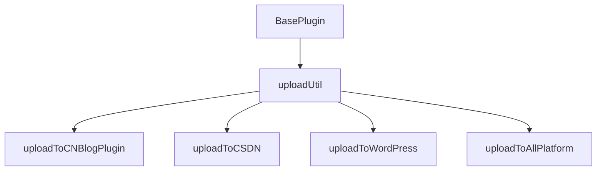
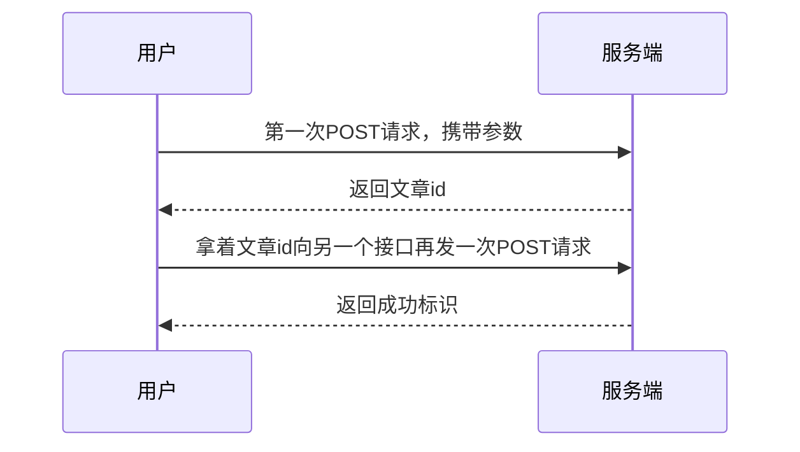

# 自动上传文章插件

由于CSDN是直接逆向的接口，上传文章大概是2-3s，两个selenium自动化的平台上传时间长一点，20s左右

### 原因

​		有谁跟我一样，每次写完博客想发布时都得重新登一次wp（因为我隐藏了wp登录的url，防爆破的），wp登录又奇慢无比，手动把标题和文章粘贴过去，设置`标签`、`分类`，`封面图`，慢慢的，5分钟-10分钟就过去了。如果先发到其他平台，还是得手动访问、复制、粘贴、设置标签。

​		但是，我这个插件完完全全可以解决这个问题，配置好配置文件，每次写完博客，右键点击，或者指定快捷键，只需要把typora挂在后台，你就可以去写代码或者干其他事情了。实在是**太方便了！！！**

​		虽然每个平台都是我要手动逆向或者用selenium自动化适配，但是我本人是一个博客重度玩家，我也一直在用这个插件，所以不用担心用着用着不维护了的问题，不过话说国内这些平台也不会有事没事改请求参数或者页面结构。下面给出支持平台和未来特性：

平台支持

- [x] CSDN
- [x] 博客园
- [x] WordPress

- [ ] vitepress&hexo
- [ ] 微信公众号
- [ ] 自建博客

特性支持

- [x] 一键上传，自动识别文章标题

- [ ] 定时发布&延时发布
- [ ] 标签、分类、封面图

未来不会支持

- [ ] 批量发布（批量发布容易被风控，且这个应该是一次性脚本做的事情）
- [ ] 知乎平台

### 配置

#### 引入依赖

默认两个插件是启用的，但需要**引入一些依赖**：

首先在typora `resources\packages.json`  中，追加下面这个依赖

```json
"dependencies": {
    "chromedriver": "^125.0.2",
    "marked": "^12.0.2",
    "selenium-webdriver": "^4.21.0"
}
```

如下图


1. 如果你是程序开发人员，电脑有node环境，在当前路径下，运行`npm i`即可

   ⚠️ 运行之前先把之前的`node_modules`包的几个依赖给备份一下（如下），下载好再粘回来。使用node下载依赖会删除原有的`fswin`包

   

   

2. 如果你是小白，请下载这个压缩包，解压到node_modules文件夹即可


#### 自定义配置

下载完成以后，有两处可供配置。

1. 配置插件`显示隐藏`、`插件名称`、`快捷键`等信息，与插件配置相同，参考：[typora_plugin/plugin/global/settings/请读我.md](https://github.com/obgnail/typora_plugin/blob/master/plugin/global/settings/请读我.md)

   

2. 配置个人信息，这些信息在`plugin\global\settings\uploadConfig.yaml`文件配置，参照注释


关于cookie的获取，登录后随便找个异步请求把所有cookie值粘过来即可


#### 禁用

如果您想要**禁用**，首先进入`.\plugin\global\settings`，找到`settings.user.toml`文件（初次使用需要先拷贝`settings.default.toml`一份，具体参考作者文档[typora_plugin/plugin/global/settings/请读我.md](https://github.com/obgnail/typora_plugin/blob/master/plugin/global/settings/请读我.md)。并看下方图片


### 实现原理

具体实现还是在本项目上做扩展，具体实现代码继承结构抽象出来如下



#### CSDN

CSDN是通过逆向发布文章接口实现的，分析了一下请求，流程是这样的（其实第一个请求文章就发出去了）




​		两个请求其实都是大差不差的，具体的参数就是要逆向的参数有`x-ca-nonce`、`x-ca-signature`这两个参数其他，其他两个x开头的是固定的。

- 第一个参数是随机数的意思，一看格式UUID没跑了
- 第二个不知道用的啥加密算法，正常情况是需要去代码里面逆向的，结果服务端给我返回了一个`message: 'HMAC signature does not match' }`，跟我说是HMAC算法，直接搜参数名一打断点就搜到了，js实现加密逻辑即可。

ℹ️关于cookie，应该能撑一个月，截止到我写文章已经两天了，现在cookie还是没问题

#### WordPress&博客园

​		发现逆向还是挺累的，用户还需要定期更新cookie，这两个网站用selenium自动化。就是枯燥无味的找`输入框`，`点按钮`，`进frame`，`执行赋值脚本`。

❗wp同学需要注意，你的md编辑器一定要是wordpress自带的，因为我只适配了这个富文本编辑器。如下


### 未来拓展思路

​		`标签`、`分类`、`封面图`、`定时发布`、`演示发布`特性的添加，我的思路是结合本插件中的[文件模版功能](https://github.com/obgnail/typora_plugin?tab=readme-ov-file#templater文件模板功能)和[斜杠命令功能](https://github.com/obgnail/typora_plugin?tab=readme-ov-file#slash_commands斜杠命令)，精准把所有参数都切割出来，考虑缺省功能。

- 催更！！！[Albert Zhang](https://github.com/AZCodingAccount)
- 本项目提[issue](https://github.com/obgnail/typora_plugin)要求支持新特性

---


---

